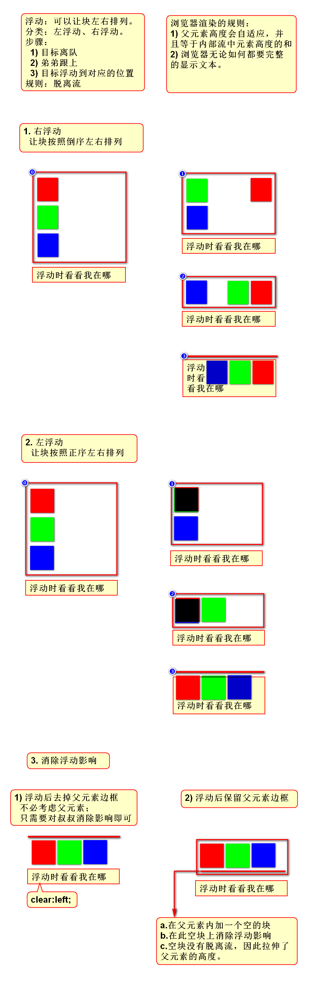
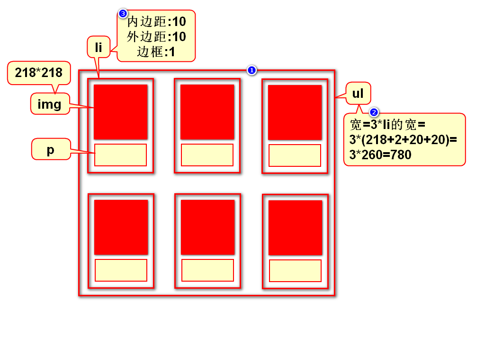
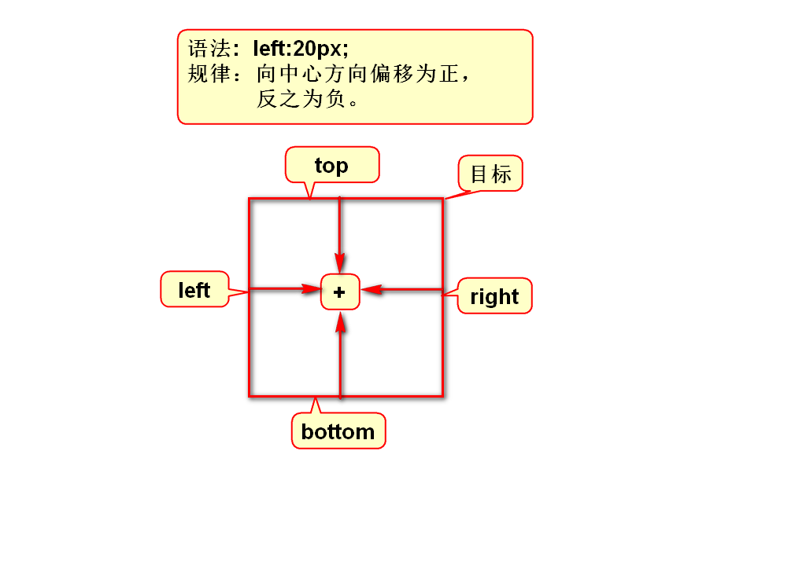
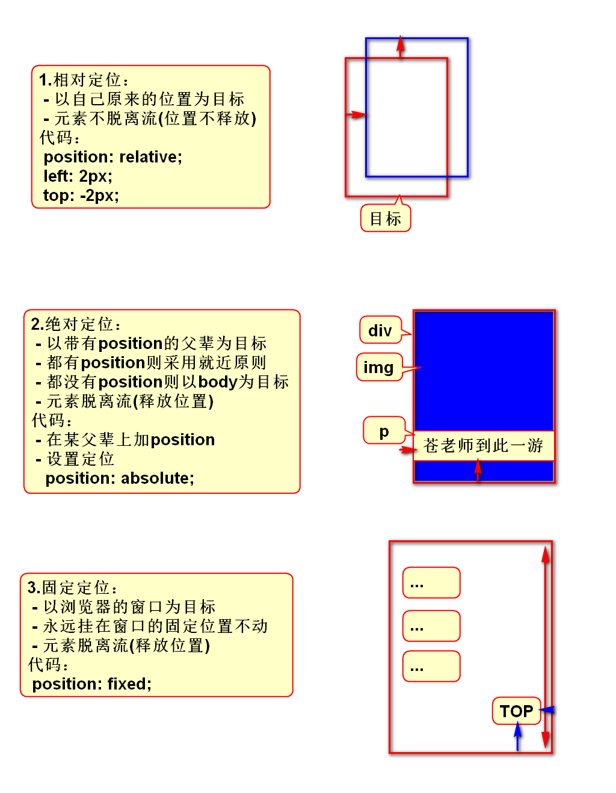
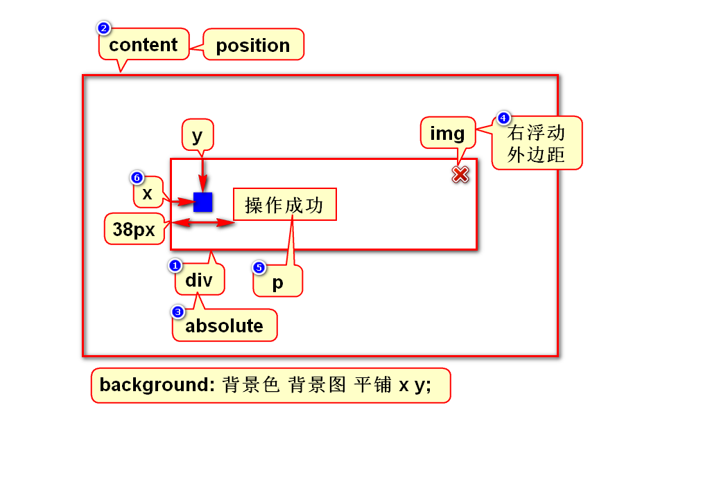

# 一、定位的简介
## 1.定位的作用
- 定位用来解决元素的排列(摆放)问题
> 使用定位可以将元素随心所欲的摆放到任意位置

## 2.有哪些定位
### 1)默认的定位
- 块元素垂直排列
- 行内元素水平排列
- 这种默认的排列方式称之为流定位
> 流：元素有序的排列的队伍

### 2)特殊的定位
- 浮动定位：可以让块左右排列
- 相对定位：相对于自身产生很小的偏移
- 绝对定位：相对于父亲产生很大的偏移
- 固定定位：相对于窗口产生很大的偏移
> 后3种定位本质一样，都是相对于某目标产生偏移

# 二、浮动定位
## 1.浮动原理

## 2.照片墙案例

# 三、相对、绝对、固定定位
## 1.区别和联系
- 相同点：它们设置偏移量的方式一样
- 不同点：它们设置偏移时参考的目标不同

## 2.案例

# 四、如何选择定位方式
1. 固定定位
2. 浮动定位
3. 相对定位
4. 绝对定位

# 五、管理员列表(第5版)

