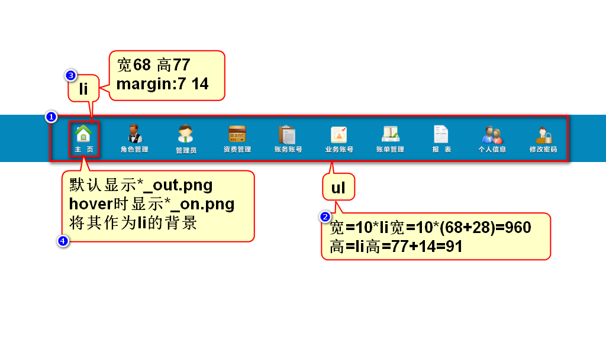
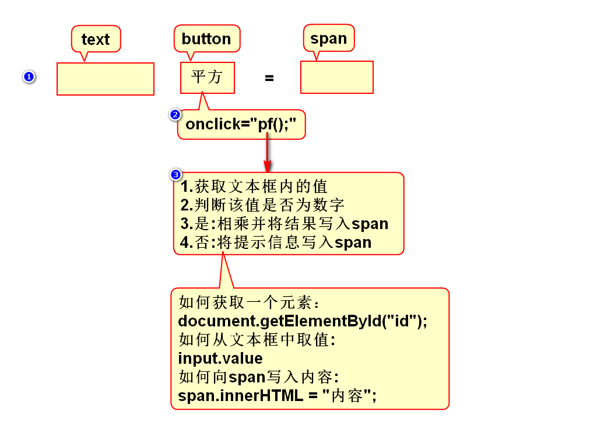
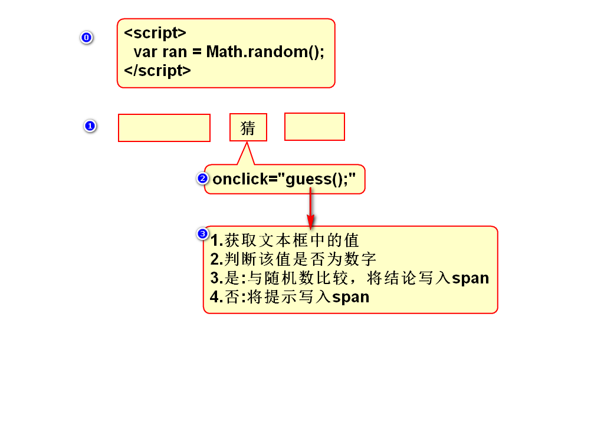

# 一、元素的显示方式
## 1.元素有哪些显示方式
### 1)块
- 有宽高、垂直排列
- h/p/ol/ul/div/table/form

### 2)行内
- 无宽高、水平排列
- span/b/strong/i/em/u/del/a/label

### 3)行内块
- 有宽高、水平排列
- img/input/select/textarea

## 2.如何修改显示方式
- 块：display:block;
- 行内：display:inline;
- 行内块：display:inline-block;
- 隐藏：display:none;

# 二、管理员列表(第6版)

# 三、计算平方案例

# 四、调试技巧
## 1.看报错信息
- 看浏览器控制台的报错信息

## 2.打桩
- 看代码的流程是否正确
- 看过程中的变量值是否正确

## 3.排除法+二分法定位问题
- 写了大量代码后，报方法未定义的错误
- 删除一部分代码，观察还是否报错
- 建议每次删除一半代码(二分法)

# 五、猜数字案例
