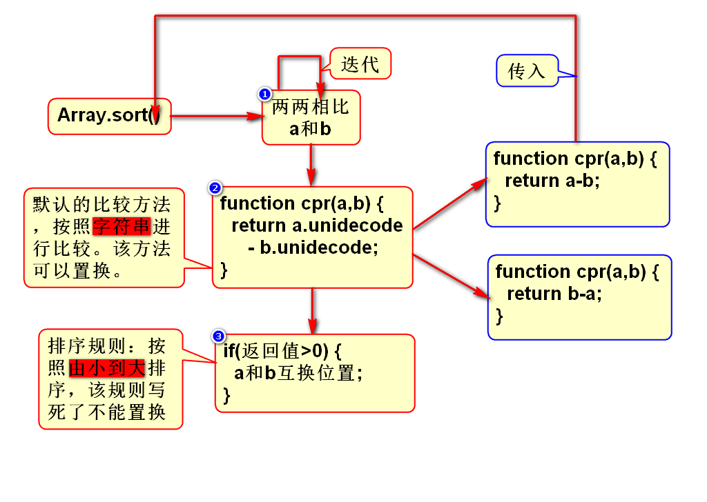

# 一、内置对象
## 1.String
- JS中的String有length属性，在Java中是length()
- JS比Java多了一个方法：s.charCodeAt(n)
- JS比Java少了一个方法：replaceAll()
> JS中的String和Java类似，了解

## 2.Number(重要)
- toFixed(n) 重要

## 3.Boolean
- 没有什么API需要了解

## 4.Array(重要)
- 如何创建数组
- 数组倒转方法
- 数组排序方法(重要)

## 5.Math
- 和Java类似，了解

## 6.Date
- 项目中一般都在服务端用Java创建日期
- 服务器给浏览器返回的日期可以用js中的Date处理

## 7.RegExp
### 1)如何创建正则对象
- var reg = /\d/g;
- var reg = new RegExp("\\d","g");

### 2)检测模式
- g：global，全局模式
- i：ignore，忽略大小写模式

### 3)正则对象的方法
- reg.test(str) 相当重要
- reg.exec(str)

