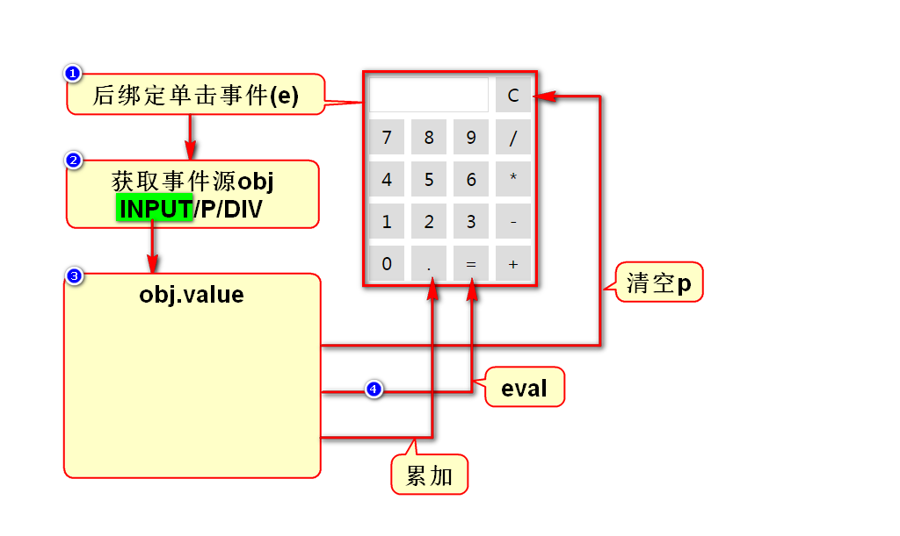

# 一、自定义对象
## 1.直接量(JSON)
- var a = {"name":"zs","age":25}
- 一个{}代表一个对象，内含多个键值对
- key一般是字符串，value是任意类型的数据
> 采用直接量方式创建出来的对象也叫JSON对象

## 2.构造器(new的函数/首字母大写)
### 2.1内置构造器
- 特定：Date、RegExp、Array
- 通用：Object

### 2.2自定义构造器
- 自定义一个函数，首字母大写
- 该函数上声明需要调用者传入的参数
- 调用new函数，来获得一个对象

## 3.结论
- 无论用哪种方式创建出来的对象本质是一样的
- 若创建对象给别人用，建议用2.2
- 若创建对象给自己用，看个人喜好选择1或2.1

# 二、事件
## 1.事件概述
### 1.1什么是事件
- 就是用户的动作、操作
- 就是JS被调用的时机
> 用户在做出什么操作时才触发调用JS

### 1.2事件分几类
- 鼠标事件
- 键盘事件
- 状态事件：某条件达成时自动触发

## 2.如何定义事件
### 2.1直接定义事件
- 在元素上通过属性直接定义事件
- 如：onclick="f1();"
- 优点：直观、方便
- 缺点：HTML和JS耦合度高

### 2.2后绑定事件
- 在页面加载后，用JS获取某节点，给它绑定事件
- 绑定事件的行为都是用JS实现的
- 优点：HTML和JS耦合度低
- 缺点：不直观

### 2.3取消事件
- 在事件函数内retuen false即可

## 3.事件对象
### 3.1什么是事件对象
- 事件触发时很多信息可以固定，如坐标、按键等
- 这些信息可能在开发时要用(用的场景不是很多)
- 浏览器为了便于程序员获取这些信息方便，
- 将他们统一封装到了一个对象里，叫做事件对象event

### 3.2如何获得事件对象
#### 1）直接定义事件时
- onclick="f1(event);"
- 在函数f1(e)中增加参数接收event

#### 2）后绑定事件时
- 事件触发并调用函数时，浏览器会自动传入event
- 只需要在函数f2(e)中增加参数接收event

## 4.事件的处理机制
### 4.1冒泡机制
- 事件是由内向外传播的
- 这个规律就叫做冒泡机制

### 4.2冒泡机制的作用
- 可以简化事件的定义
- 如果有很多元素都需要定义事件
- 可以只在它们父亲上定义一次事件即可
- 按照冒泡机制最终事件会传播到它们的父亲上

### 4.3使用冒泡机制时需解决的问题
- 需要知道事件产生在哪个具体的子元素上
- 事件产生的具体位置叫做事件源
- 通过事件对象可以获取事件源

