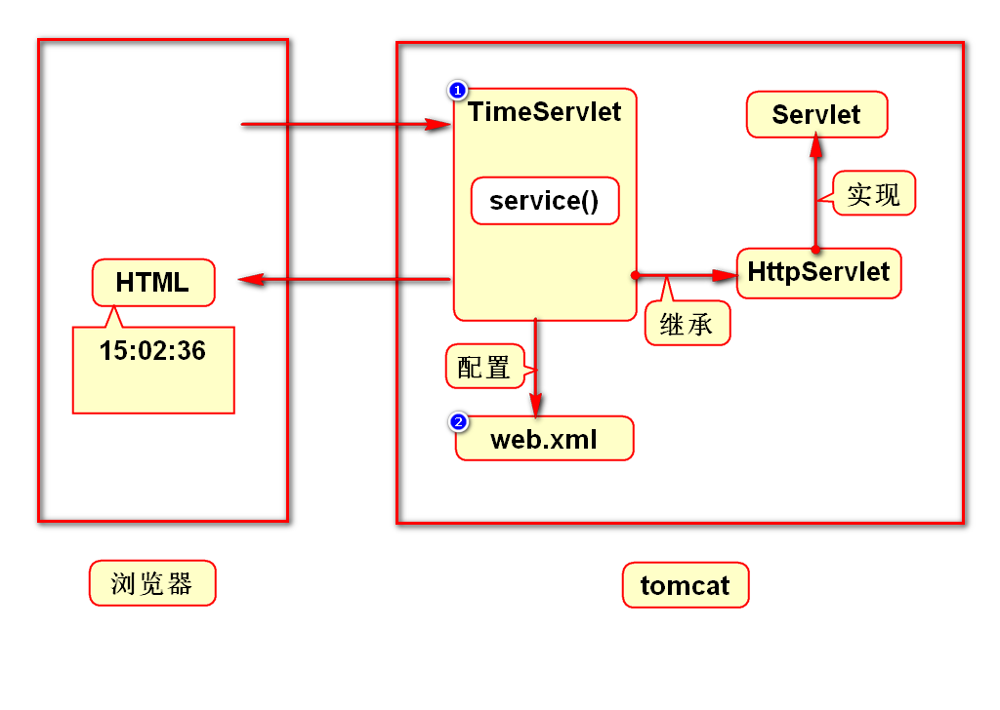

# 一、WEB应用的发展
## 1.规律
- 由单机程序向网络程序发展
- 由CS程序向BS程序发展

## 2.CS和BS的区别
### CS
- Client Server
- 客户端服务器程序，客户端由程序员开发，用户要安装

### BS
- Browser Server
- 浏览器服务器程序，不需要单独开发及安装

# 二、Servlet介绍
## 1.服务器如何给浏览器返回网页？
### 1)返回静态网页
- 百度百科、新闻
- 内容不变，任何人看都一样
- 服务器保存一个HTML，访问时直接返回它

### 2)返回动态网页
- 微博、淘宝
- 每个人看的内容有差别
- 服务器保存一个组件，用它来拼一个动态网页
- 在Java项目中，这个组件就是Servlet
> 组件：就是满足规范的对象

## 2.Servlet具备的特征
- Servlet是存储在服务器上的
- Servlet满足sun的规范
- 它可以拼动态资源(网页、图片等)
> 术语：可以处理HTTP协议

## 3.什么是Servlet
- 是sun推出的用来在服务器端处理HTTP协议的组件

# 三、服务器
## 1.名称
- Java服务器
- WEB服务器
- Java WEB服务器
- Servlet容器

## 2.本质
- 是一个软件：能够运行Java项目的软件
- 和浏览器相对应、平级

## 3.举例
- Tomcat
- JBoss
- WebLogic
- WebSphere

# 四、如何使用tomcat
## 1.单独使用(上线时)
### 1)配置JAVA_HOME
- tomcat依赖于Java
- 使用个人笔记本的同学需要配置
- 使用达内电脑的同学不用，上面已经配置好了

### 2)下载及安装
- 在apache官网下载
- 在达内：http://doc.tedu.cn/tomcat/
- 直接解压缩(释放)即可，这是绿色免安装软件
> 达内的学习机上已经下载并安装好了，在/tts9/apache-tomcat7.0.67

### 3)启动tomcat
- Linux：打开/tomcat/bin目录，输入./startup.sh
- window：打开/tomcat/bin目录，双击startup.bat
> 给目录加权限：chmod +x *sh

### 4)访问tomcat
- 打开浏览器，输入http://localhost:8080
- 看到一只猫着代表启动成功

### 5)关闭tomcat
- Linux：打开/tomcat/bin目录，输入./shutdown.sh
- windows：打开/tomcat/bin目录，双击shutdown.bat

## 2.用Eclipse管理tomcat(开发时)
- 1)参考：doc.tedu.cn/tomcat
- 2)配置失败需要从来：
- window->preferences->server->runtime environment
- 选择tomcat点击remove
- Eclipse左侧点击Servers项目将其删除

# 五、Servlet开发步骤
## 1.创建WEB项目
- WEB项目有标准的WEB目录：
- webapp/WEB-INF/web.xml

## 2.导入jar包
### 1)用maven搜javaee
- 在搜索结果中选择javaee-api.jar

### 2)使用tomcat内置的jar包
- 右键项目->properties->targeted runtimes->勾选tomcat->apply

## 3.开发Servlet
- 继承于HttpServlet
- 间接实现了Servlet接口(sun的规范)

## 4.配置Servlet
- 在web.xml中加以配置

## 5.部署项目
- 在Servers下点击tomcat
- 右键点击Add and Remove
- 弹出框中将项目从左侧移动到右侧
- 启动tomcat
> 部署：就是拷贝

## 6.访问Servlet
- http://localhost:8080/servlet1/ts

# 六、代码执行过程及错误

# 补充
## 一、端口占用错误
### 1.出现问题的情况
- 报错：Address already in user,JVM_BIND:8080

### 2.原因及解决方案
#### 1)tomcat启动了2次，造成端口冲突
- 打开/tomcat/bin目录，执行shutdown命令，强制关闭它

#### 2)其他软件占用了此端口(Oracle)
- 修改tomcat的端口
- 打开tomcat配置文件server.xml
- 在65行修改port="8080"，建议改为8088、8089等
- 注意：关闭tomcat时修改，然后重新启动
> 在Servers项目下可以找到server.xml配置文件

