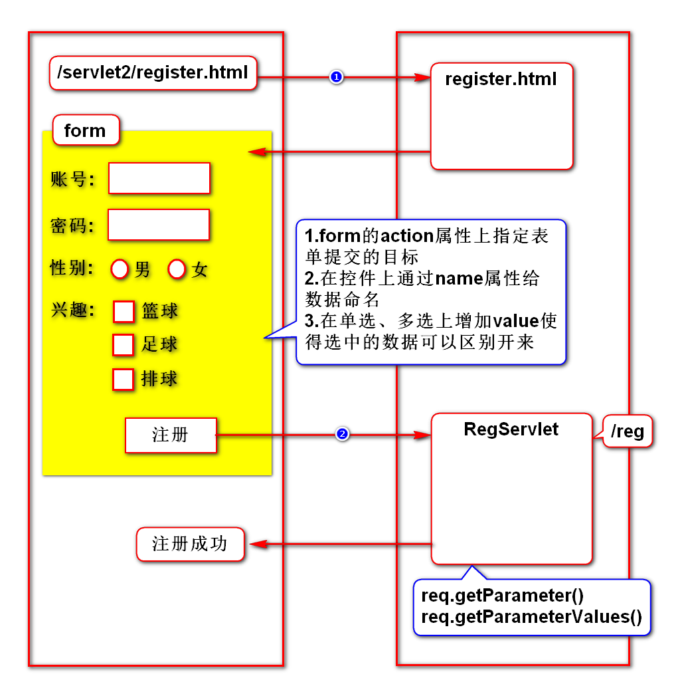
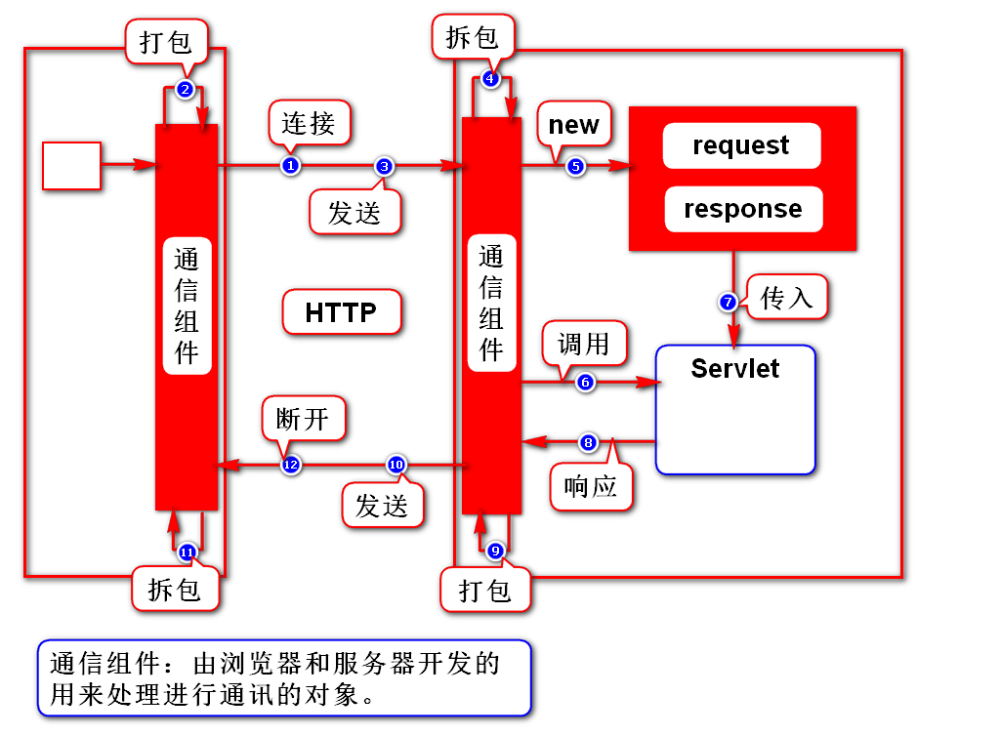
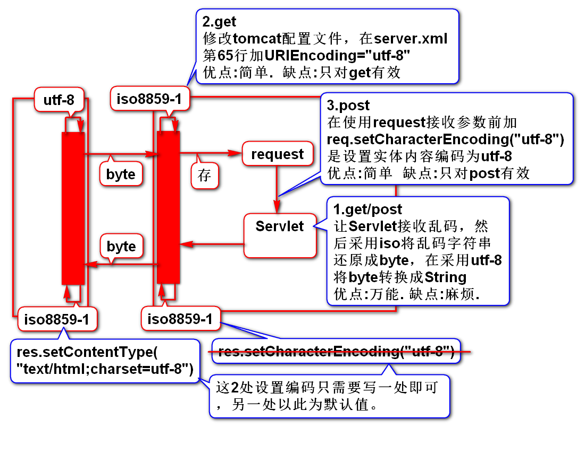
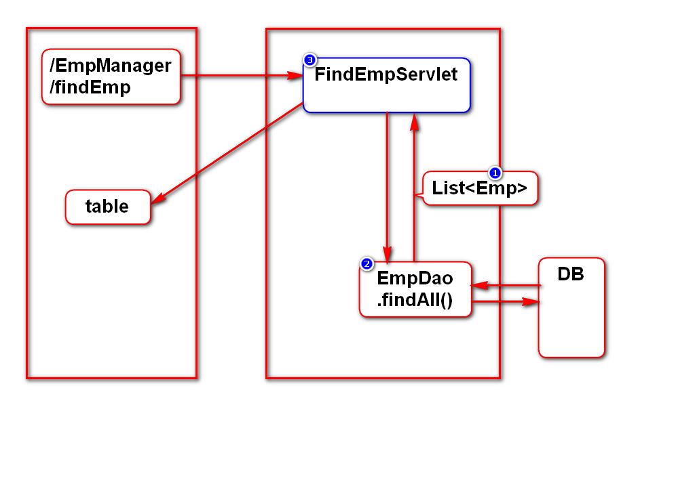
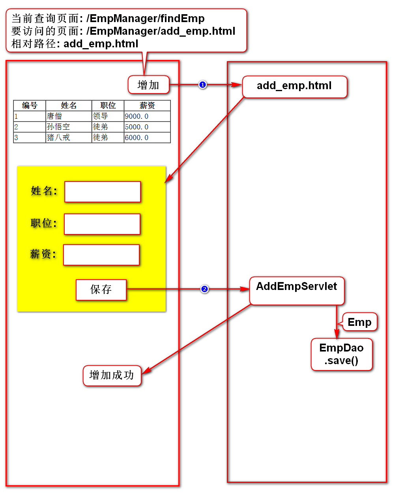

# 一、HTTP协议
## 1.什么是HTTP协议
- 就是一个规范(w3c)
- 规定了：浏览器和服务器如何通信及数据格式

## 2.如何通信
- 建立连接
- 发送请求
- 接收响应
- 关闭连接

## 3.数据格式
### 1)请求数据(浏览器向服务器发送的数据)
- 请求行：请求的基本信息
- 消息头：请求数据的描述信息
- 实体内容：请求的业务数据

### 2)响应数据(服务器向浏览器发送的数据)
- 状态行：响应的基本信息
- 消息头：响应数据的描述信息
- 实体内容：响应的业务数据

## 4.对开发的要求
### 1)不需要管的地方
- 通信的过程已经由浏览器和服务器实现了
- 请求数据的组装由浏览器实现了
- 响应数据的组装由服务器实现了

### 2)需要处理的地方
- 请求的业务数据由开发者提供
- 响应的业务数据由开发者提供
> 使用request处理请求数据，使用response处理响应数据

# 二、注册案例

# 三、Servlet运行原理

# 四、请求方式
## 1.什么是请求方式
- 浏览器向服务器发送数据的方式
- 包括很多种方式，需要掌握的是GET和POST

## 2.GET和POST方式的区别
### 1)GET
- 采用路径传参，参数在传递过程中可见(地址栏)
- 隐私性差
- 传参能力有限，只能传少量参数
- 所有的请求默认都是GET请求

### 2)POST
- 采用实体内容传参，参数在传递过程中不可见
- 隐私性好
- 实体内容专门用来传参，大小不受限制
- 在form上加method="post"

## 3.如何选择请求方式
- 一般查询时使用GET请求，因为查询条件一般比较少
- 一般保存时使用POST请求，因为保存的数据一般较多

# 五、乱码解决方案

# 六、案例
## 1.查询员工

## 2.增加员工

# 补充
## 1.什么是JavaBean
- 满足如下规范的类：
- 有package
- 有默认构造器
- 实现序列化接口
- 有get/set方法