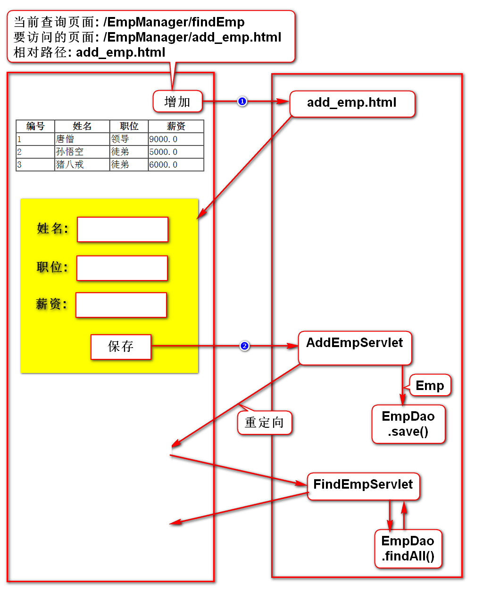
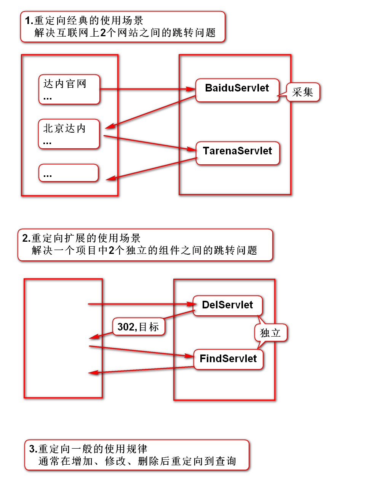
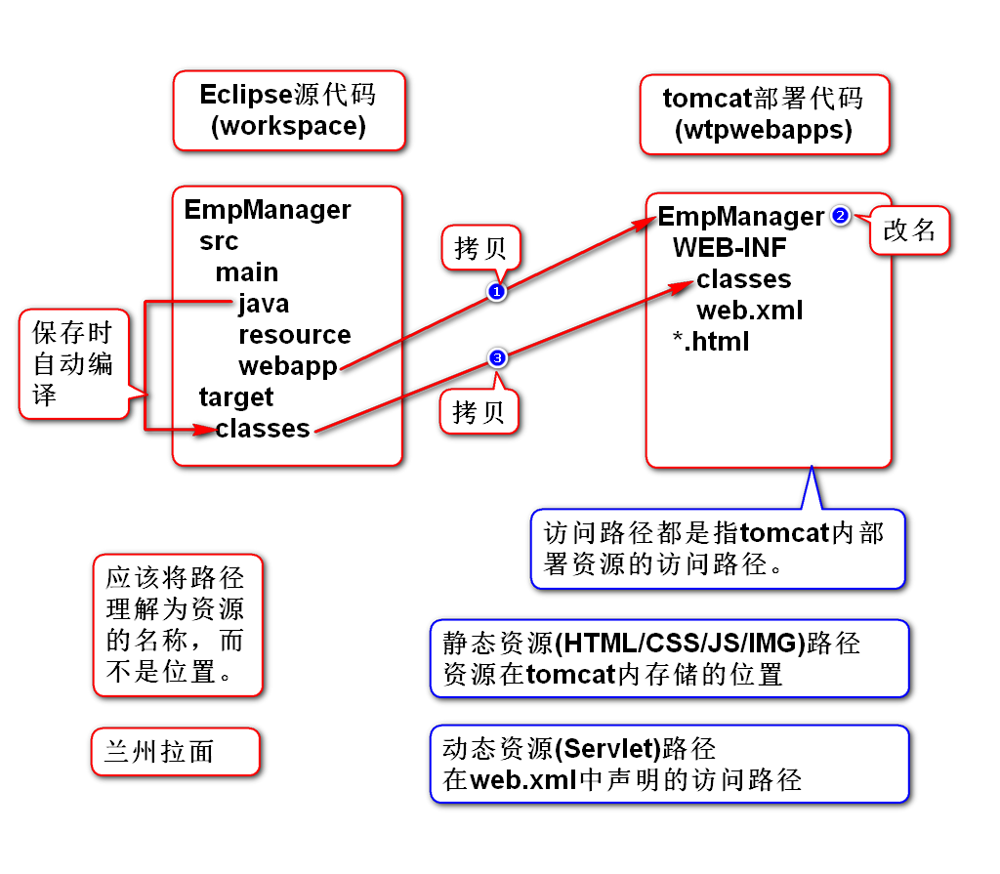
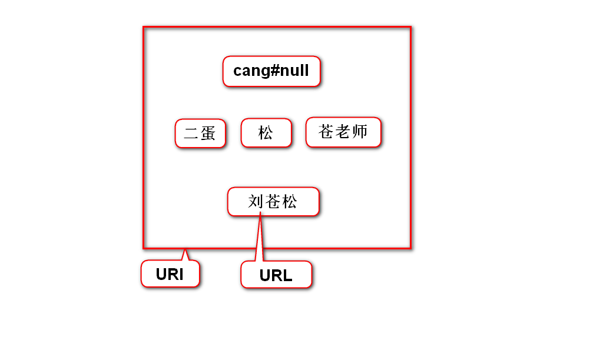
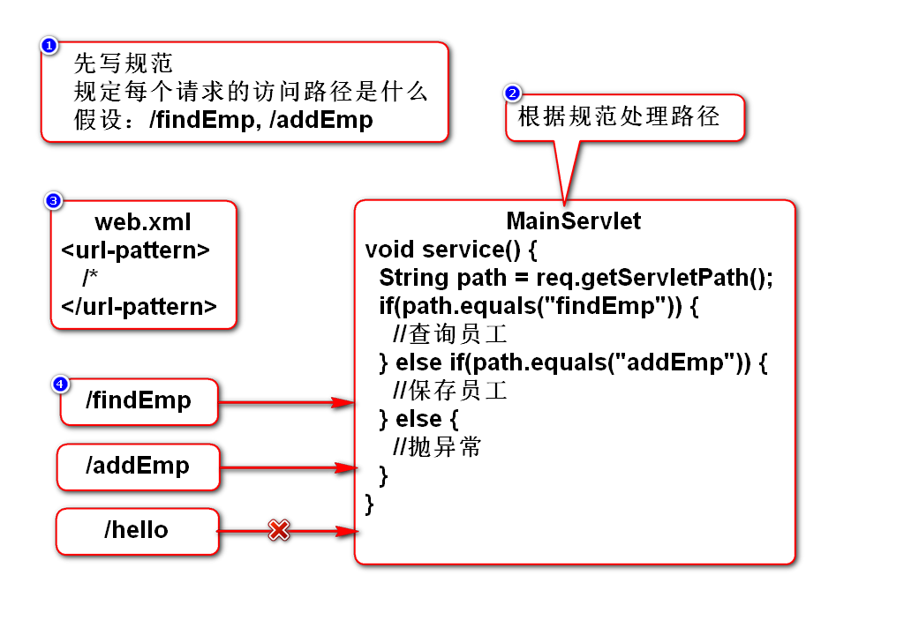
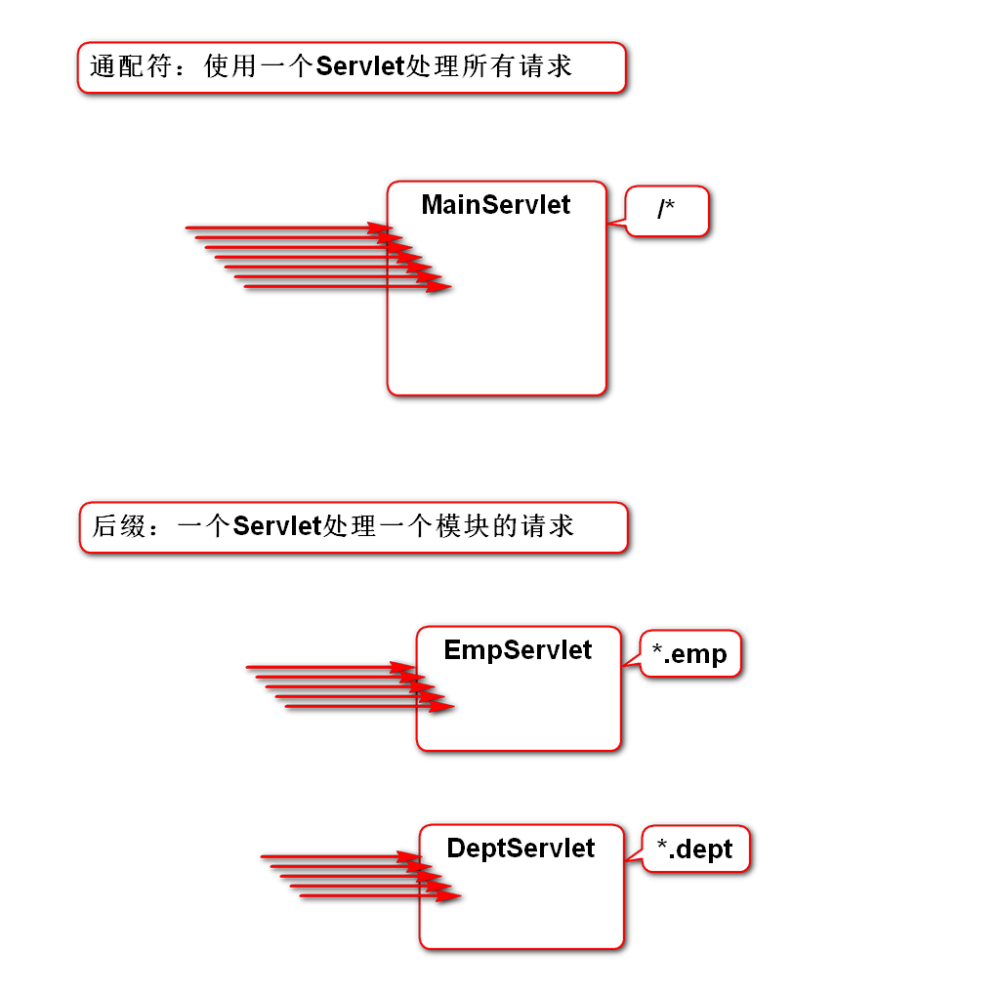
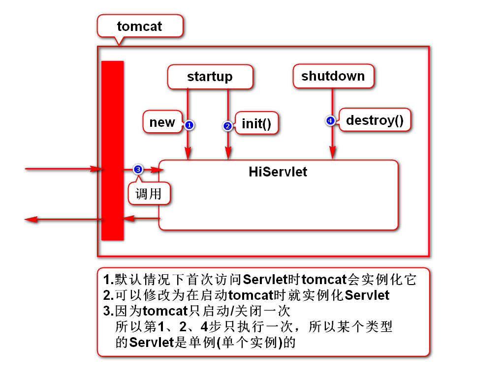
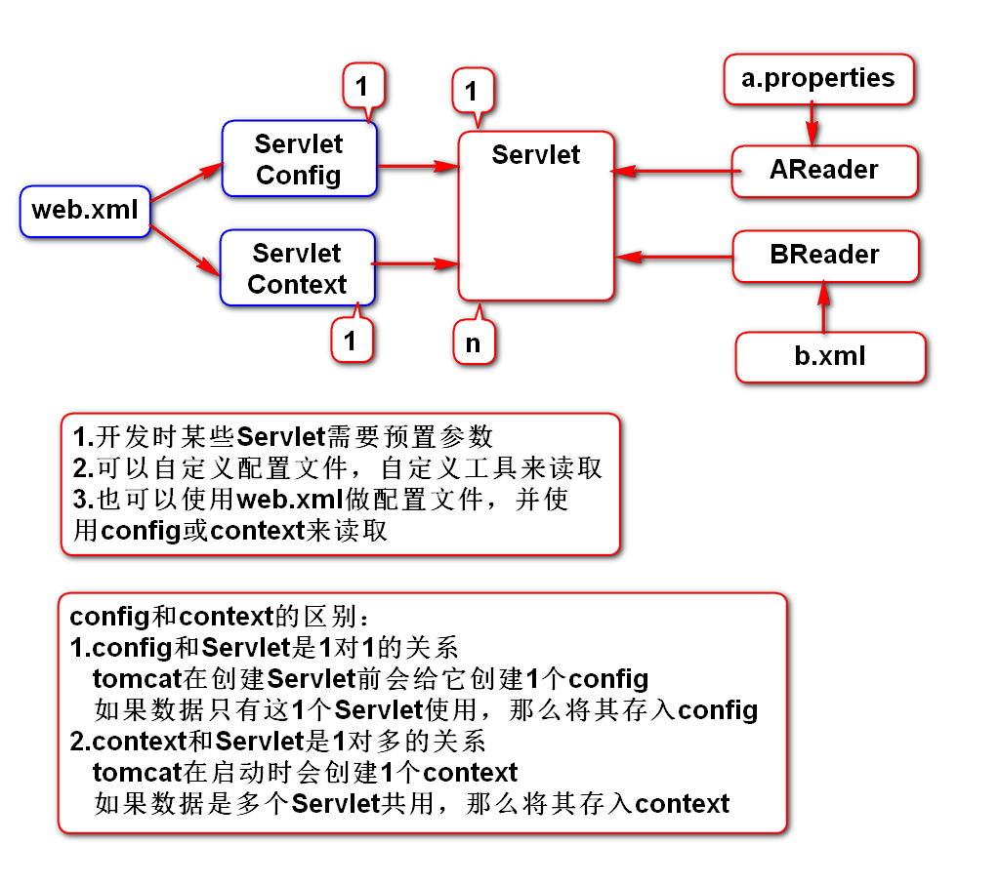
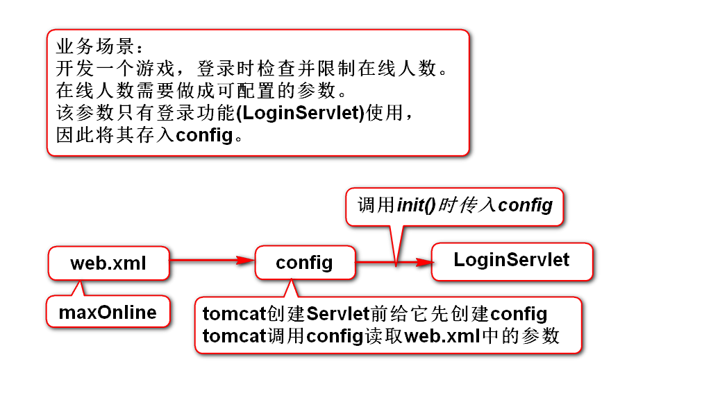
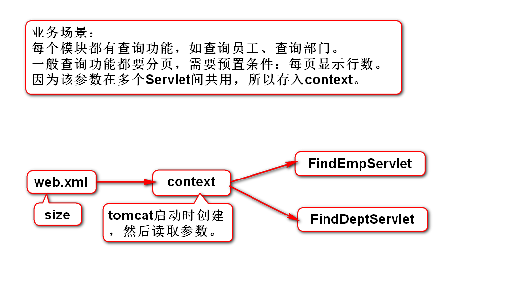

# 一、重定向
## 1.重定向在增加员工中的应用

## 2.重定向的作用及原理

# 二、路径
## 1.路径是什么

## 2.如何获取路径
- 项目名：req.getContextPath()
- Servlet路径：req.getServletPath()
- 绝对路径：req.getRequestURI()
- 完整路径：req.getRequestURL()

## 3.URI和URL的区别
### 1)狭义的理解(Java项目)
- URI是绝对路径，而URL是完整路径
- URL包含了URI

### 2)广义的理解(Web项目) *
- URI是资源的名字
- URL是资源的真名
- URI包含了URL
> 真名只有一个，名字可以有多个

## 4.Servlet访问路径的配置方案
### 1)精确匹配(/hello)
- 只有这一个路径可以访问此Servlet
- 此Servlet只能处理一个请求

### 2)通配符(/*)
- 所有的路径都可以访问此Servlet
- 此Servlet能处理所有请求

### 3)后缀(*.abc)
- 所有以abc为后缀的路径都可以访问此Servlet
- 此Serlvet能处理多个请求

### 4)用1个Servlet处理多个请求的方案

### 5)通配符和后缀的典型应用场景

# 三、Servlet生命周期
## 1.生命周期相关方法的调用顺序

## 2.config和context的联系和区别

## 3.ServletConfig

## 4.ServletContext

