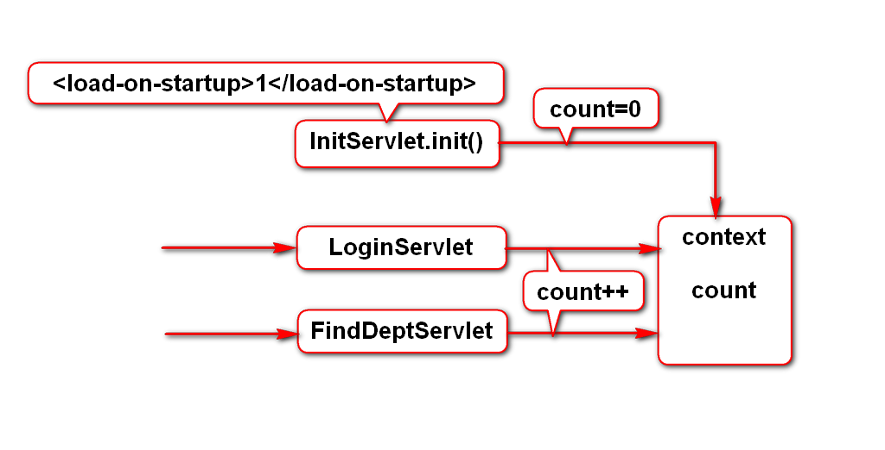
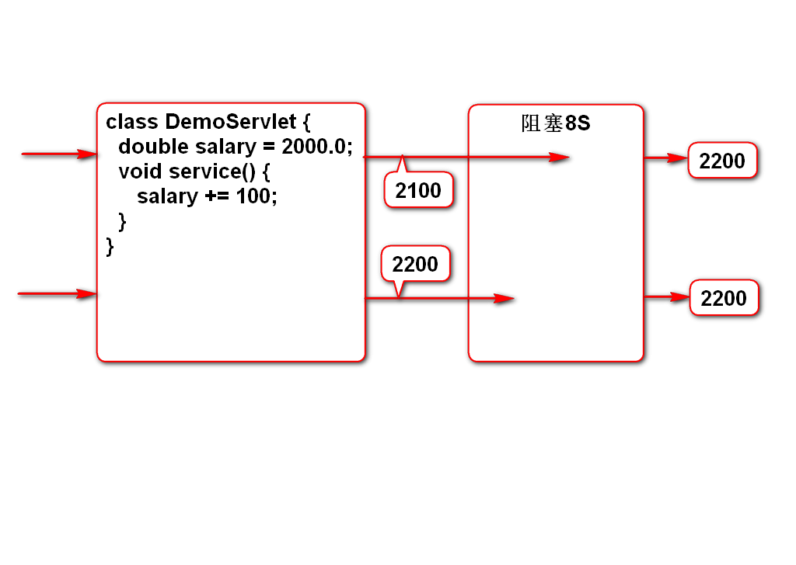
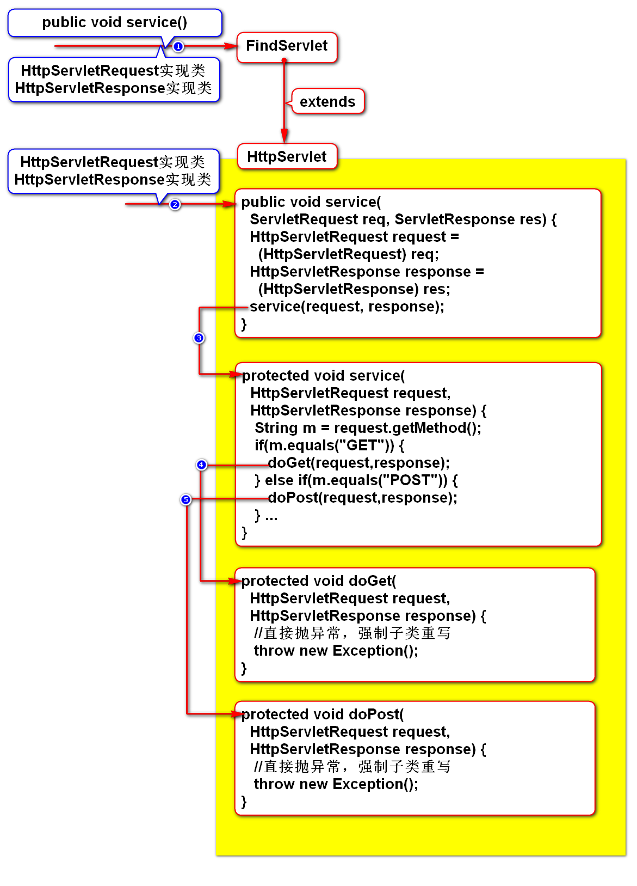
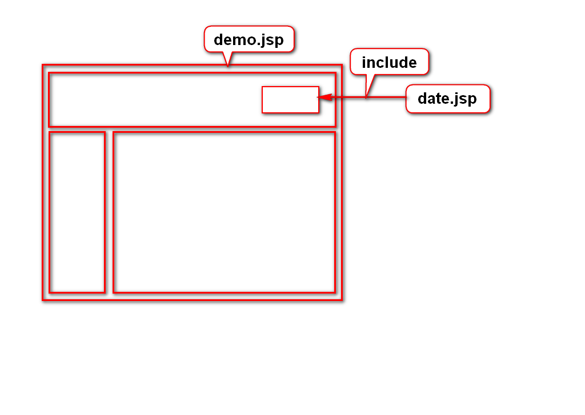
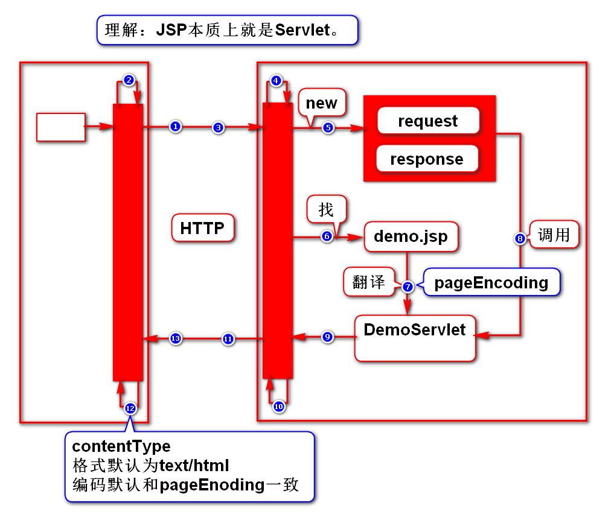
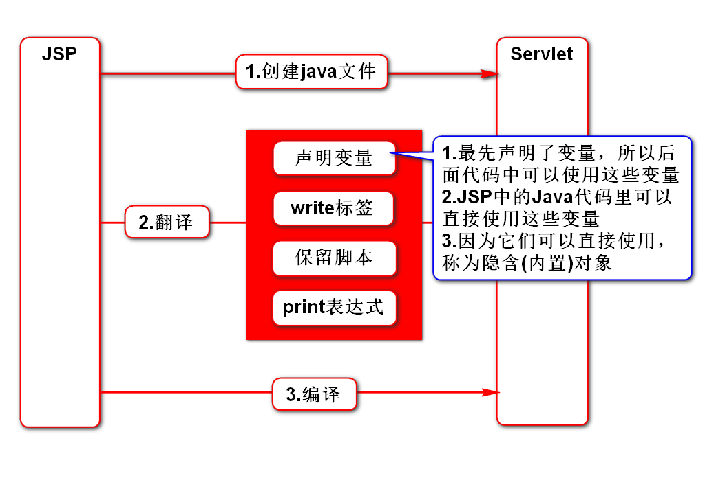

# 一、context的特殊用法
## 1.使用场景
- 之前使用config和context读取的都是web.xml中配置的常量
- 有时候我们需要存取的可能是变量
- context支持存取变量，给多个Servlet共用

## 2.案例
- 给软件做一个统计流量(访问量)的功能
- 流量是一个变量，无论访问哪个Servlet，流量+1

# 二、线程安全问题
## 1.什么时候会出现线程安全问题
- 多人同时修改同一份数据时有此问题
- 局部变量存储在栈里，每个线程有自己的栈帧，没有问题
- 成员变量存储在堆里，所有线程共享这个数据，可能有问题
> 多个人同时修改成员变量

## 2.如何解决线程安全问题
- 加锁

# 三、HttpServlet介绍(了解)
- sun这样设计是为了让开发者有更多选择的空间

# 四、JSP
## 1.include指令

## 2.JSP运行原理

## 3.隐含(内置)对象
### 什么是隐含对象
- 就是在JSP上可以直接使用的对象
- 这些对象是在service方法一开始就声明的

### 有哪些隐含对象
#### 1) request
- HttpServletRequest

#### 2) response 
- HttpServletResponse

#### 3) out
- JSPWriter
- 等价于PrintWriter

#### 4) config
- ServletConfig

#### 5) application
- ServletContext

#### 6) exception
- Throwable
- 是JSP生成的Servlet所报的错

#### 7) session
- HttpSession
- 后面重点讲

#### 8) page
- Object
- 相当于this

#### 9) pageContext
- PageContext
- 管理者，引用了其他8个隐含对象

### 总结
- 上述9个对象的名字是固定的
- 它们都可以在JSP上直接使用

### 使用的例子
- <%String user = request.getParameter("user");%>
- <%=request.getParameter("user")%>