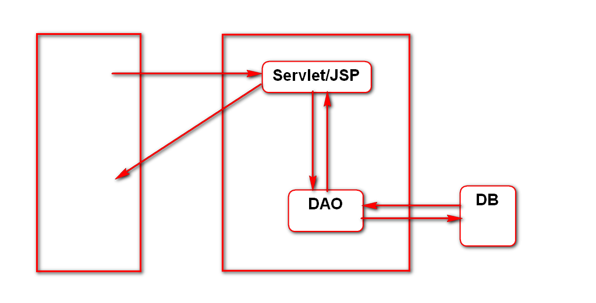
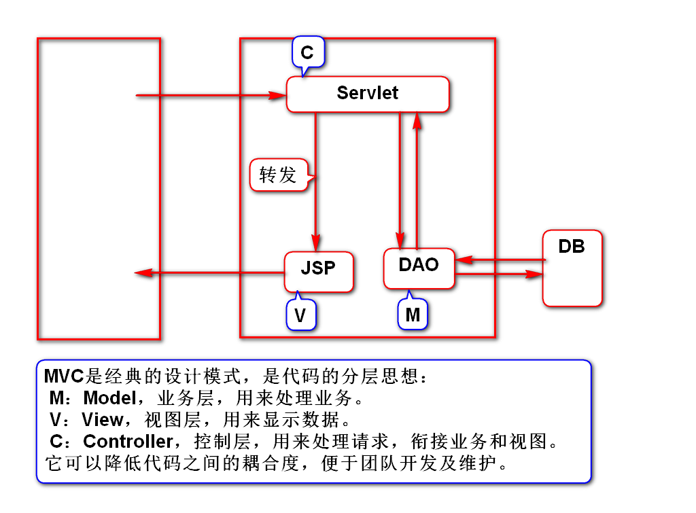
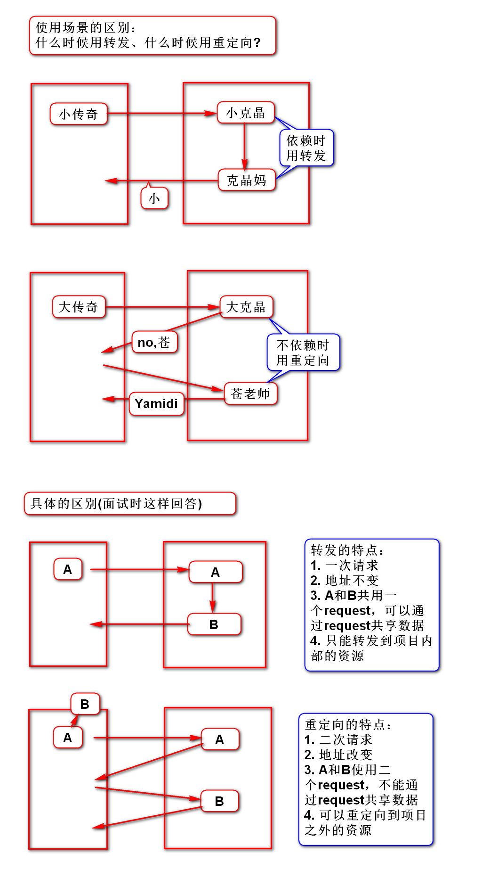
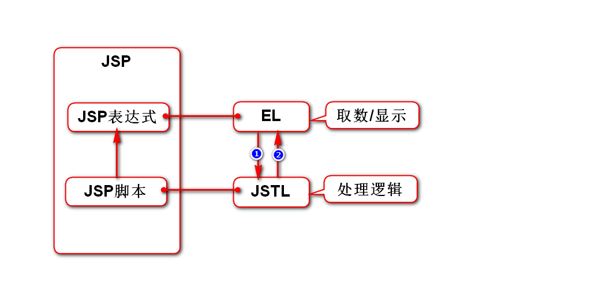
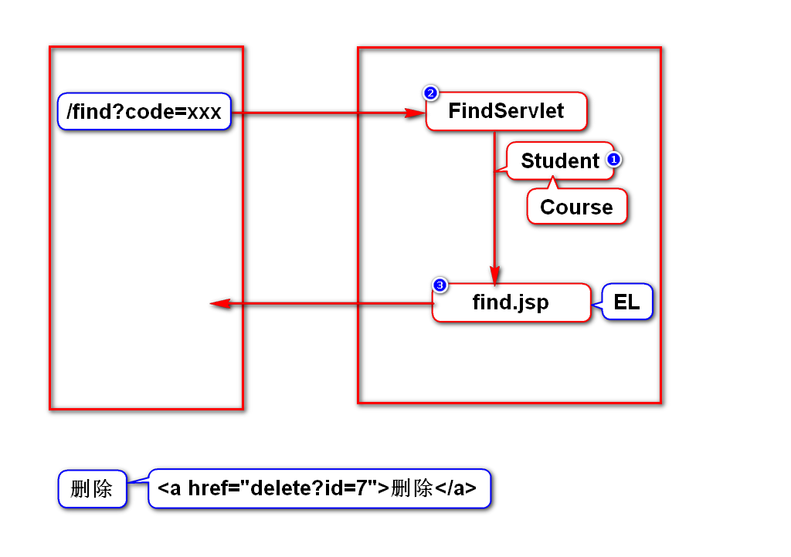
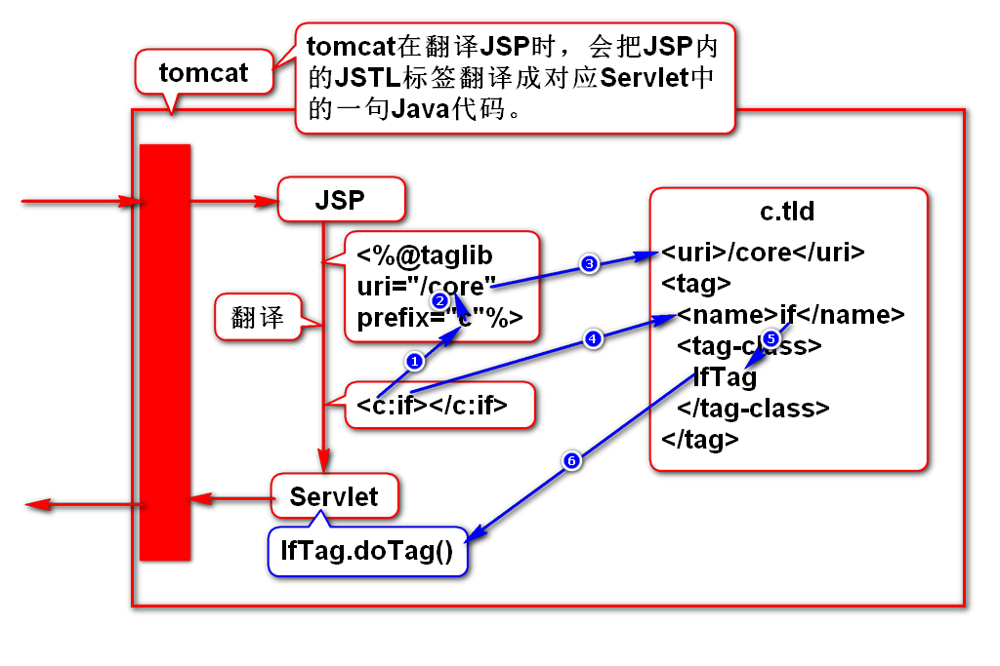

# 一、开发模式
## 1. Model 1
- 使用一个组件(Servlet/JSP)处理请求
- 缺点：该组件将java和HTML高度耦合在一起

## 2. Model 2(MVC)
- 使用2个组件协同处理请求
- 优点：将java和HTML代码解耦

# 二、转发和重定向
## 1.它们的相同点
- 都是用来解决web组件之间的跳转问题
- web组件：Servlet/JSP

## 2.它们的区别

## 3.它们的一般使用场景
- 一般查询时从查询Servlet转发到查询JSP
- 一般增加、修改、删除(Servlet)后重定向到查询(Servlet)

# 三、EL和JSTL
## 1.作用

## 2.案例

## 3.JSTL运行原理
