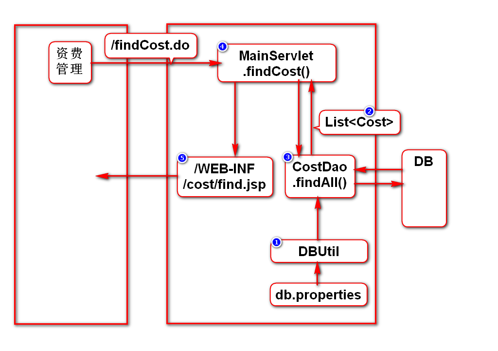
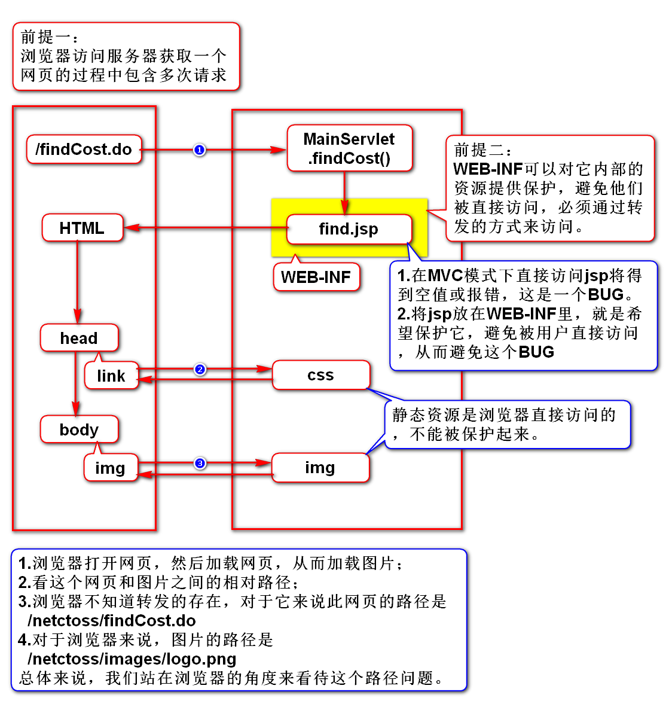
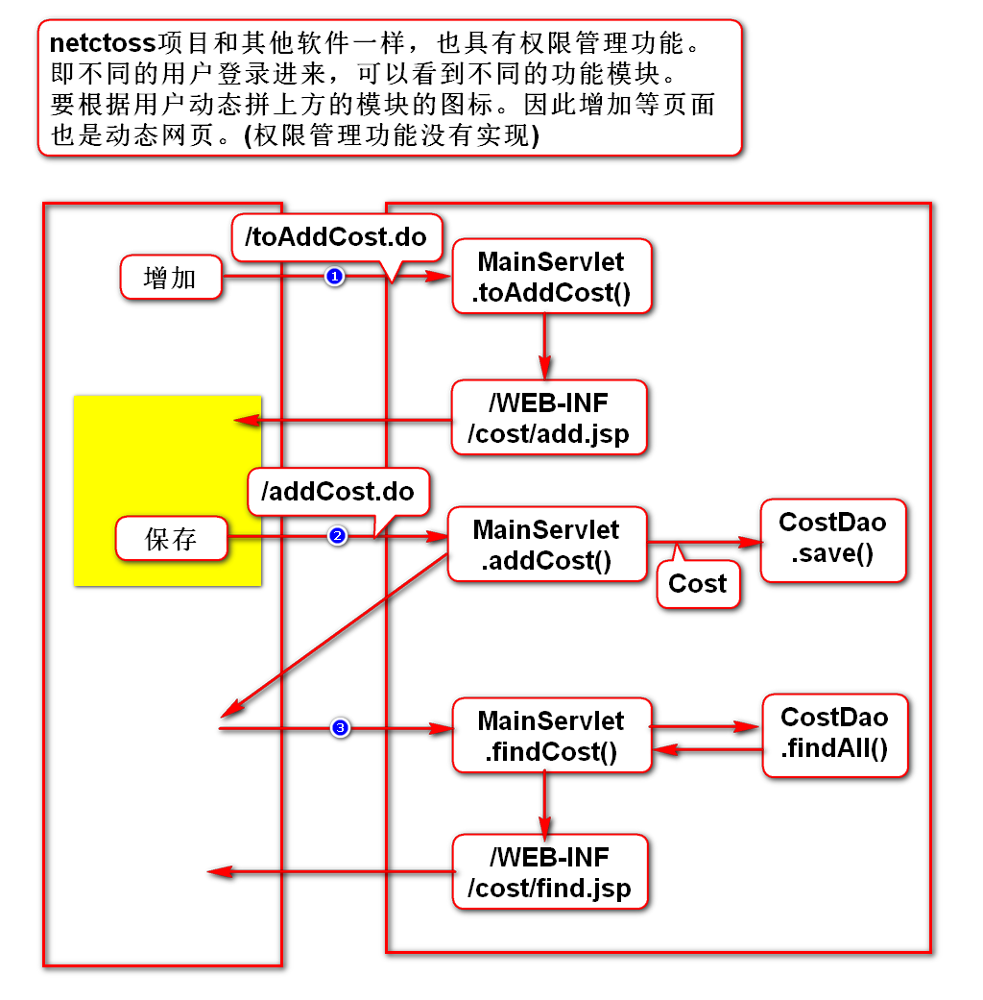

# 一、NETCTOSS项目
## 1.名词解释
- NET：网络
- C：China
- T：Telecom 电信
- O：Operation 运营
- S：Support 支持
- S：System 系统
- 中国电信运营支持系统-网络版

## 2.搭建环境
### 1)创建WEB项目
- 项目名：netctoss

### 2)导包(jar)
- javaee:导入tomcat自带的jar包
- jstl:使用maven搜jstl，选择jstl1.2
- ojdbc:使用maven搜ojdbc，选择10.2.0.4.0
- dbcp:使用maven搜commons-dbcp，选择1.4

## 3.开发思路
- 根据操作判断该功能包含几个请求
- 分析每个请求的代码执行过程
- 逐个请求按照步骤开发

# 二、查询资费
## 1.开发思路

## 2.WEB-INF的作用

# 三、增加资费
