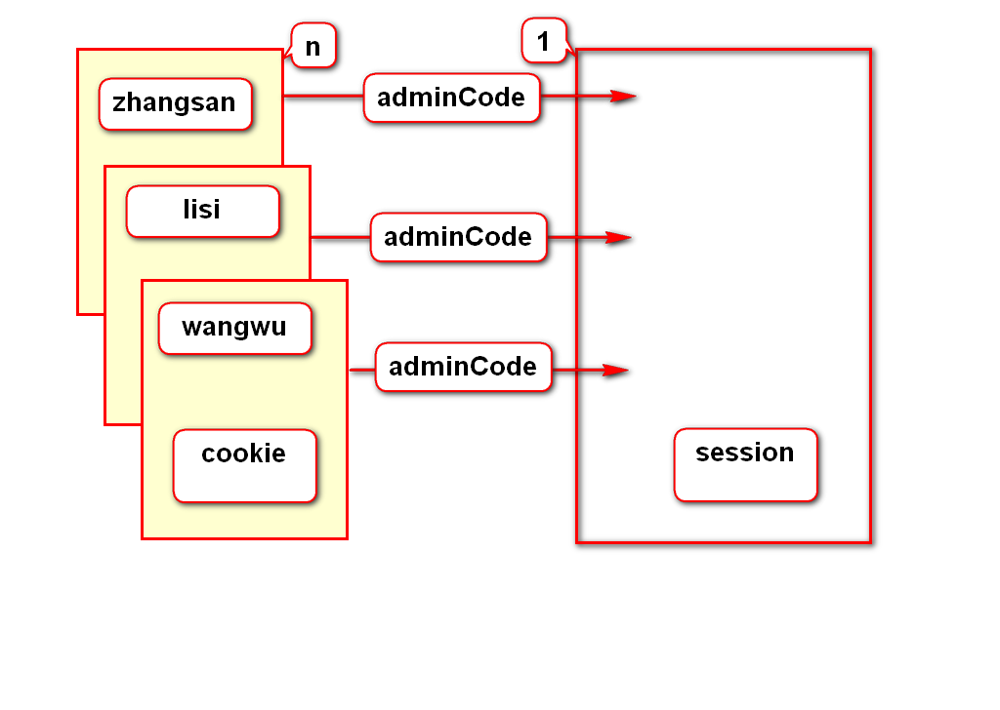
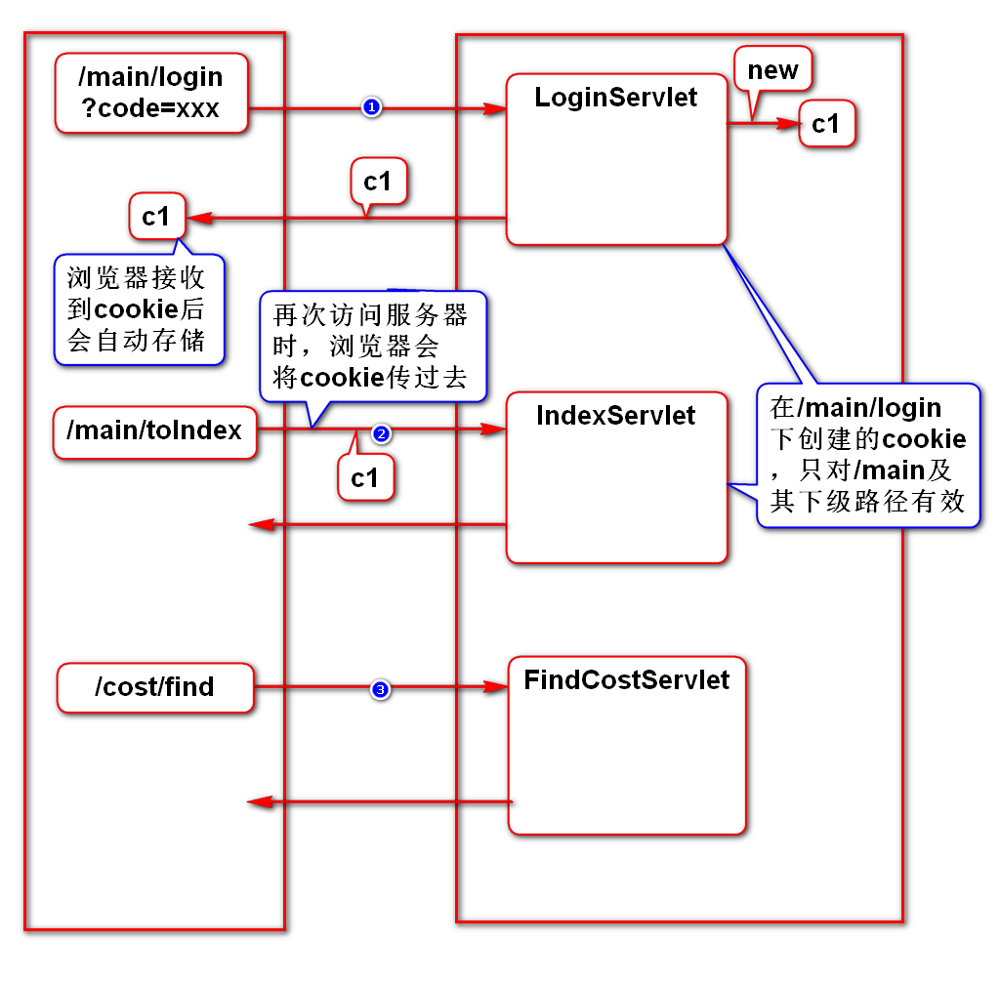
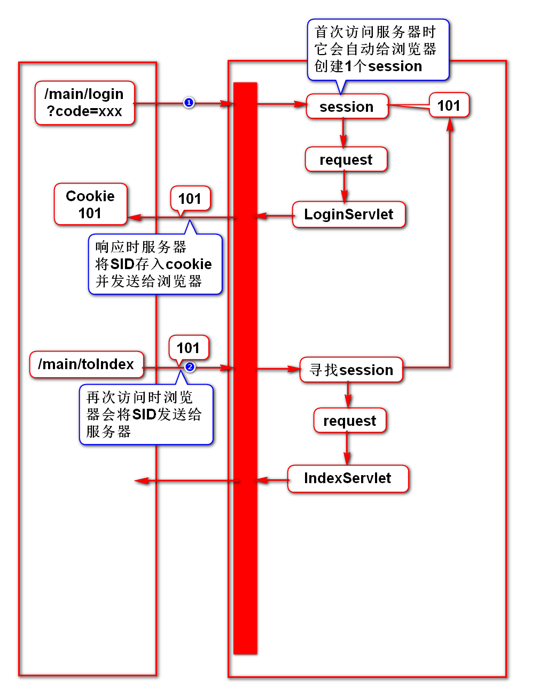

# 一、cookie和session简介
## 1.浏览器和服务器是多对一的关系
## 2.业务：登录时记录账号，后续的页面上显示此账号
## 3.使用如下对象存储账号都不行
- request：多个请求之间共用账号，不能用request
- config：多个Servlet之间共用账号，不能用config
- context：多个浏览器传入多个账号互相影响，不能用context

## 4.cookie和session才能解决此类问题
- 在此对象中的数据可以在多个请求之间共用
- 在此对象中的数据可以在多个Servlet之间共用
- 此对象按照浏览器存储数据，将数据彼此分开，互不影响

## 5.cookie和session的区别
- cookie：存储在浏览器上，服务器压力小，但容易被篡改
- session：存储在服务器上，服务器压力大，但不能被篡改

## 6.如何选择
- 重要的数据存在session中
- 不重要的数据存在cookie中

# 二、cookie
## 1.案例

## 2.cookie学习要点
- 如何创建、获取cookie
- 如何修改cookie的生存时间
- 如何在cookie中存储中文
- cookie对哪些路径生效

# 三、session
## 1.案例

## 2.特征
- session是服务器自动创建的对象
- session id通过cookie自动传递

## 3.要点
- 如何获取session，如何存储数据(*)
- 如何销毁session(*)
- session的超时时间如何设置
- cookie被禁用时如何使用session