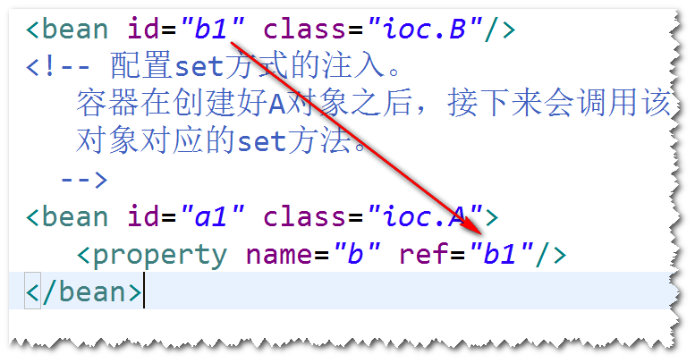
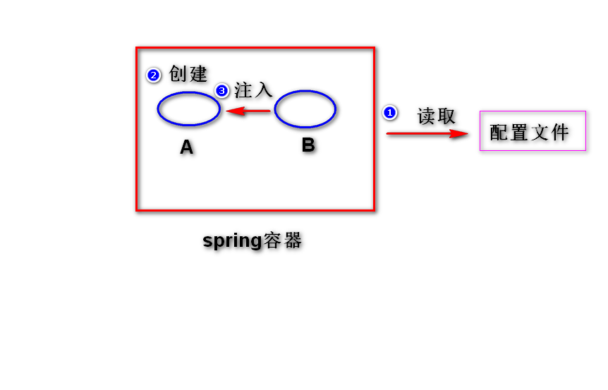

# 1.spring是什么?
是一个开源的，用来简化企业级应用开发的框架。 
理解: 
(1) 简化开发 
spring对常用的api做了简化，比如(使用springjdbc
访问数据库，就不再需要考虑获取连接与关闭连接了)。
 
(2) 解耦 
spring帮我们管理对象之间的关系，这样一来，整个软件
很好维护。 
(3) 集成      
spring可以集成其它的框架(比如，可以集成用于任务调度
的框架Quartz,集成访问数据库的框架mybatis)。 

# 2. spring容器
## spring容器是什么?
是spring框架中的一个模块，用来管理对象。 
## 如何启动spring容器?
step1. 导包。 
spring-webmvc  
step2. 添加一个配置文件。 
applicationContext.xml  
step3. 启动spring容器。   
## 如何让容器创建对象?
方式一: 使用无参构造器。(重点) 
step1. 为类提供一个无参构造器(缺省构造器) 
step2. 在配置文件当中，添加一个bean元素。 
step3. 启动spring容器，调用getBean方法来获得对象。 
方式二: 使用静态工厂方法。(了解)  
调用类的静态方法来创建对象。 
方式三: 使用实例工厂方法。(了解)  
调用对象的实例方法来创建对象。 
## 生命周期相关的几个方法。 
(1)初始化方法 
init-method属性来指定。 
(2)销毁方法  
destroy-method属性来指定。 
注意：只有作用域为"singleton"时，销毁方法才
会执行。 
## 作用域 (了解)
(1)默认情况下，不管调用多少次getBean方法，容器
只会创建一个对象。(单例)  
(2)可以设置 scope属性="prototype"，这样每getBean
一次，会创建一个新的对象。 
注：scope的缺省值是 "singleton"。 
## 延迟加载 (了解) 
(1)默认情况下，容器在启动之后，会将所有作用域为
"singleton"的bean先创建好。 
(2)如果设置 lazy-init属性值为"true",则容器启动
之后，不再将作用域为"singleton"的bean创建好。 

# 3. IOC (Inversion Of Controll 控制反转)
## IOC是什么? 
对象之间的依赖关系由容器来建立。 
## DI是什么(Dependency Injection 依赖注入)?
容器可以通过调用对象提供的set方法或者构造器来建立
依赖关系。 
(1) 采用set方法来注入

  
     
