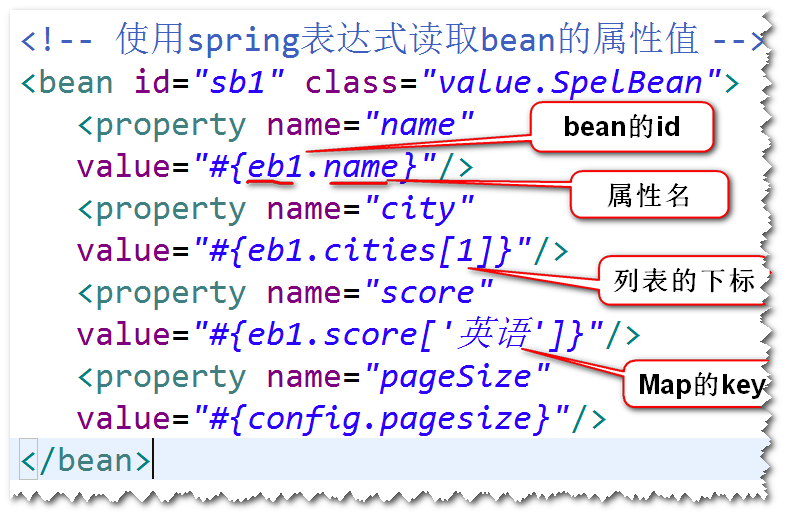

# 3. IOC (Inversion Of Controll 控制反转)
## IOC是什么? 
对象之间的依赖关系由容器来建立。 
## DI是什么(Dependency Injection 依赖注入)?
容器可以通过调用对象提供的set方法或者构造器来建立
依赖关系。 
(1) 采用set方法来注入  

(2) 构造器注入  

## 自动装配 (了解)
(1) 默认情况下，容器不会自动装配。 
(2) 可以设置autowire属性值来让容器依据某种规则 
进行自动装配。 
 byName：容器查找bean的id与属性名一致的bean,然后
调用set方法来完成注入。 

 
 byType:容器查找与属性类型一致的bean,然后调用set方
法来完成注入。注：如果找到多个，则报错。 
 constructor:容器查找与属性类型一致的bean,然后调用
构造器来完成注入。 
## 注入基本类型的值
使用value属性来注入。
## 注入集合类型的值
List
Set
Map
Properties
## 引用方式注入集合类型的值

## spring表达式
使用spring表达式读取其它bean的属性值。 

## 使用注解来简化配置
(1) 什么是组件扫描?  
容器启动之后，如果发现配置文件有component-scan元素，
则容器会扫描相应的包及其子包下面的所有的类，如果这些
类前面有一些特殊的注解(比如@Component),则容器会将
这些类纳入容器进行管理（相当于以前配置文件当中有相应的
bean元素)。 
(2) 编程步骤。 
step1. 在配置文件当中，添加component-scan元素。 
  
step2. 在类名前，添加一些注解。 
  
注：bean的默认id是首字母小写之后的类名。 
@Component 通用  
@Service  业务层  
@Repository 持久层  
@Controller 控制层  

 

