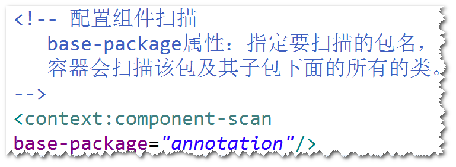
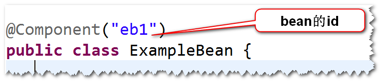
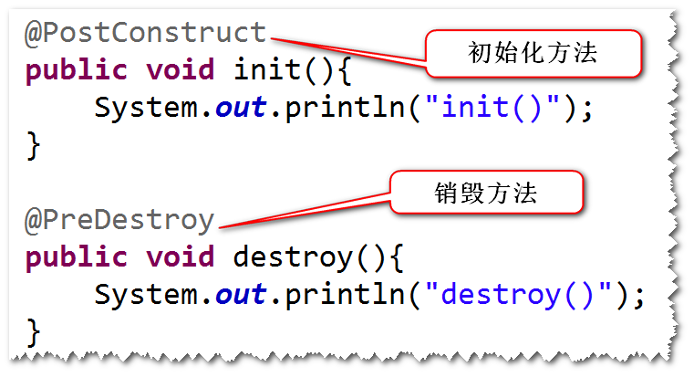
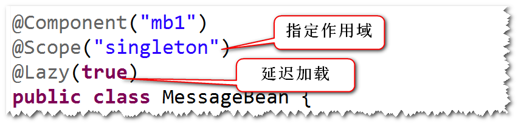
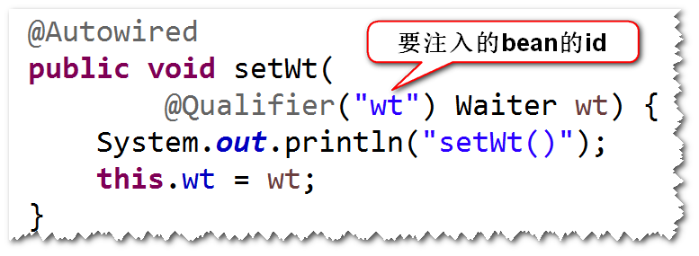
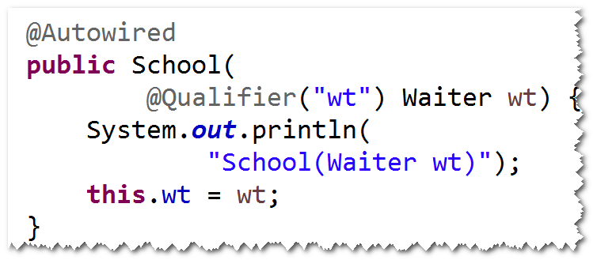
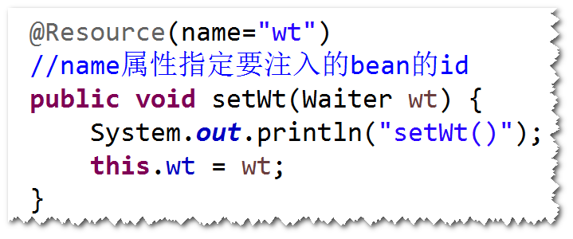
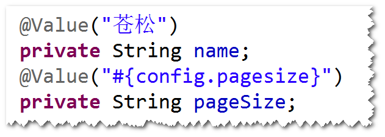
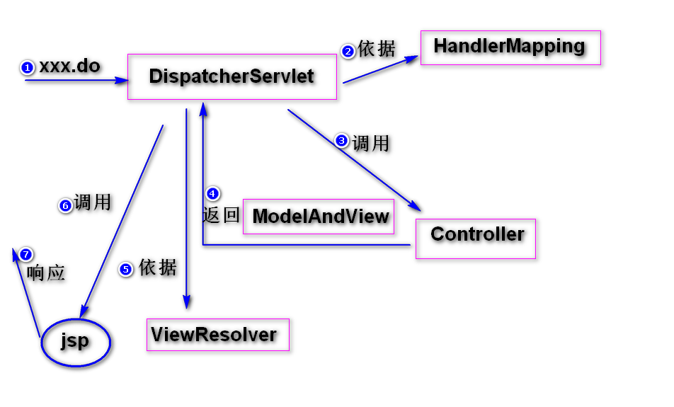
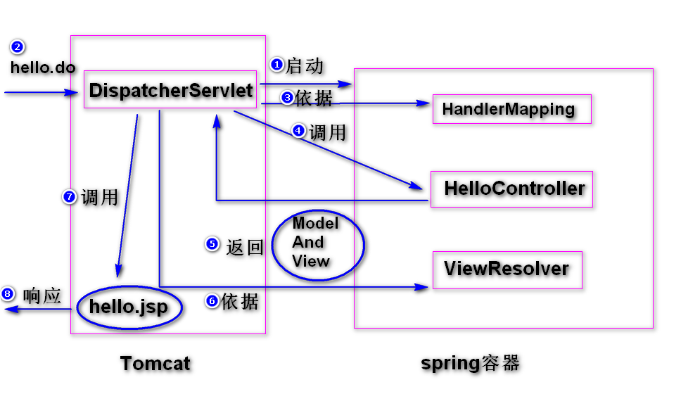

## 使用注解来简化配置
(1) 什么是组件扫描?  
容器启动之后，如果发现配置文件有component-scan元素，
则容器会扫描相应的包及其子包下面的所有的类，如果这些
类前面有一些特殊的注解(比如@Component),则容器会将
这些类纳入容器进行管理（相当于以前配置文件当中有相应的
bean元素)。 
(2) 编程步骤。 
step1. 在配置文件当中，添加component-scan元素。 
  
step2. 在类名前，添加一些注解。 
  
注：bean的默认id是首字母小写之后的类名。 
@Component 通用  
@Service  业务层  
@Repository 持久层  
@Controller 控制层  
(3)生命周期相关的两个注解: 
@PostConstruct  初始化  
@PreDestroy   销毁  
  
注：这两个注解来自于javaee,不属于spring框架。 
(4)用于延迟加载的注解: 
@Lazy(true) true表示延迟加载。 
(5)用于指定作用域的注解: 
@Scope("prototype")。
  
(6)依赖注入相关的注解  
@Autowired 和 @Qualifier  
a. 支持set方式的注入和构造器方式的注入。 
b. set方式注入： 
将@Autowired和@Qualifer加到set方法前面，
也可以加到属性前面。其中，@Qualifer用于指定
要注入的bean的id。 
注：如果不指定id,则使用byType的方式来注入。 
  
c. 构造器注入: 
将@Autowired和@Qualifer加到构造器前面即可。 
  
@Resource  
a. 只支持set方式的注入。 
b. 可以将该注解加到set方法前面，或者也可以加到
属性前。使用name属性来指定要注入的bean的id。 
  
(7) spring表达式相关的注解  
  
注：@value注解即可以用在属性前，也可以用在
set方法前。另外，也可以使用该注解注入基本类
型的值。 

# springmvc
## springmvc是什么?
是一个用来简化基于mvc架构的web开发框架,
springmvc属于spring框架的一部分。 
## 五大组件
a. DispatcherServlet (前端控制器)。 
控制器，相当于大家写的MainServlet。 
b. HandlerMapping。 
请求地址和model的对应关系。 
c. Controller (处理器)。 
处理业务逻辑。 
d. ModelAndView。 
封装处理结果(包含有视图名)。 
e. ViewResolver (视图解析器)。 
负责将视图名解析成真正的视图对象，比如jsp。 
step1. DispatcherServlet收到请求之后，依据
HandlerMapping的配置，调用相应的Controller来
处理。 
step2.Controller将处理结果封装成ModelAndView
对象，返回给DispatcherServlet。 
step3.DispatcherServlet依据ViewResolver的解析，
调用相应的视图对象（比如某个jsp）,生成相应的页面。
 
 
## 编程步骤
step1. 导包。 
spring-webmvc  
step2. 添加配置文件。 
step3. 配置DispatcherServlet。 
step4. 写Controller。 
a. 实现Controller接口。 
b. 在handleRequest方法当中，编写处理逻辑。 
step5. 写jsp  
step6. 配置HandlerMapping和ViewResolver。 
 

