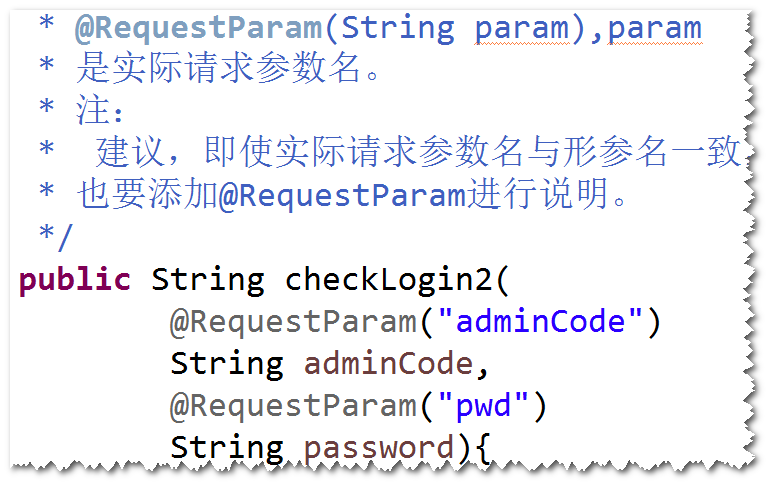

# 1. 基于注解的spring mvc应用
## (1)编程步骤
step1. 导包。 
spring-webmvc  
step2. 添加配置文件。 
step3. 配置DispatcherServlet。 
step4. 写Controller。 
	1.不用实现Controller接口。 
	2.可以添加多个方法。 
	3.方法名不做要求，返回值类型可以是
	ModelAndView,也可以是String。 
	4.在类名前添加@Controller。 
	5.使用@RequestMapping来告诉
	DispatcherServlet,请求路径与处理器的对
	应关系。 
step5. 写jsp。 
step6. spring配置文件中，需要配置： 
组件扫描,mvc注解扫描，视图解析器。 

## (2) 如何读取请求参数值
方式一: 通过request对象。 
方式二：通过@RequestParam注解。 

 
方式三: 封装成一个javabean。 
step1.写一个java类，要求属性名与实际请求参数名一致，
并提供相应的get/set方法。 
step2.在方法中添加该java类型的参数。 

## (3) 向页面传值
方式一：通过request对象。 
将数据绑订到request对象，然后转发给jsp来展现。 
注：springmvc默认使用转发机制。 
方式二：通过session对象。 
将数据绑订到session对象。 
方式三: 通过ModelMap对象。 
在方法当中，添加ModelMap对象作为参数，然后调用该
对象的addAttribute方法。 
方式四：通过ModelAndView对象。 
将处理结果添加到ModelAndView对象里面。

## (4) 如何重定向
情况1：如果方法的返回值是String，在
重定向地址前，添加"redirect:",比如
"redirect:toIndex.do"。 
情况2：如果方法的返回值是ModelAndView: 
RediectView rv = new RedirectView("toIndex.do"); 
ModelAndView mav = new ModelAndView(rv);

