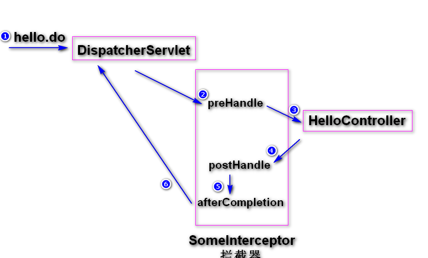
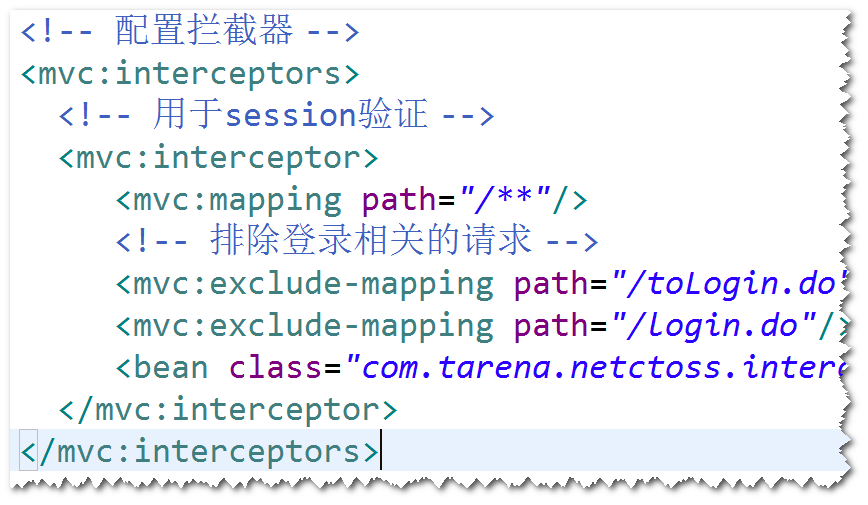

# 1. 拦截器
(1)什么是拦截器? 
spring定义的一种特殊的组件，前端控制器在收到
请求之后，会先调用拦截器的方法，
然后再调用处理器(controller)。 
注：过滤器是servlet规范当中定义的组件。 
(2)如何写一个拦截器? 
step1. 写一个java类，实现HandlerInterceptor接口。 
step2. 将拦截处理逻辑写在相应的接口方法里面： 
a. preHandle(): 前端控制器收到请求之后，会先调用
拦截器的preHandle方法，如果该方法的返回值为true,表
示继续向后调用，如果返回值为false,表示请求处理完毕，
不会向下执行。 
b. postHandle():处理器方法已经执行完毕，准备将处理
结果(ModelAndView对象）返回给前端控制器之前执行
该方法。可以在该方法里面，修改处理结果。 
c. afterCompletion():最后执行的方法。 
注意：只有当preHandle方法返回值为true,该方法才会
执行。 

 
step3.配置拦截器。 

