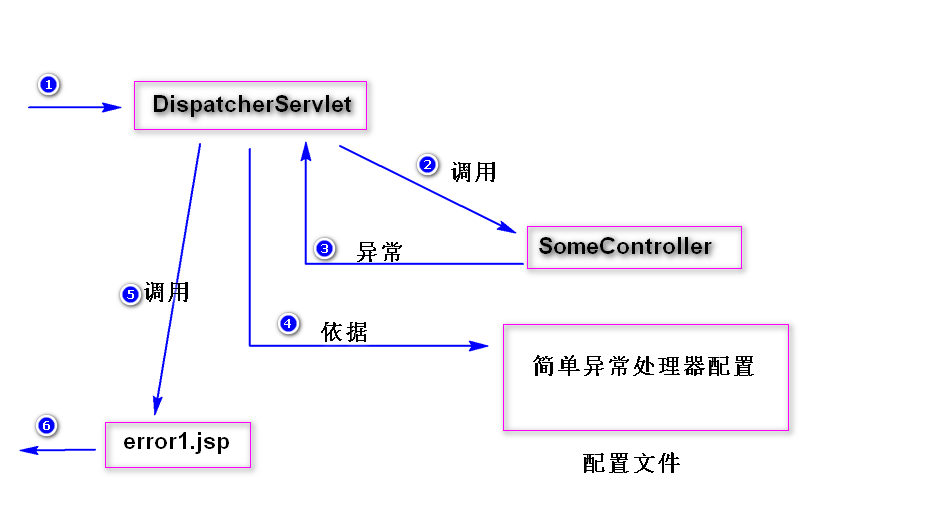
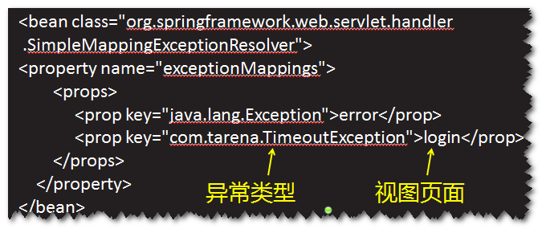
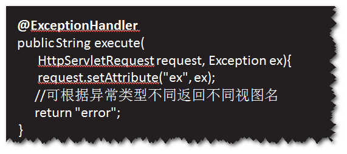
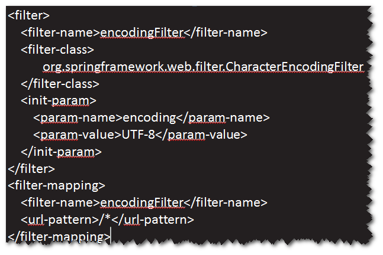
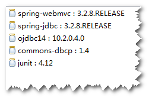
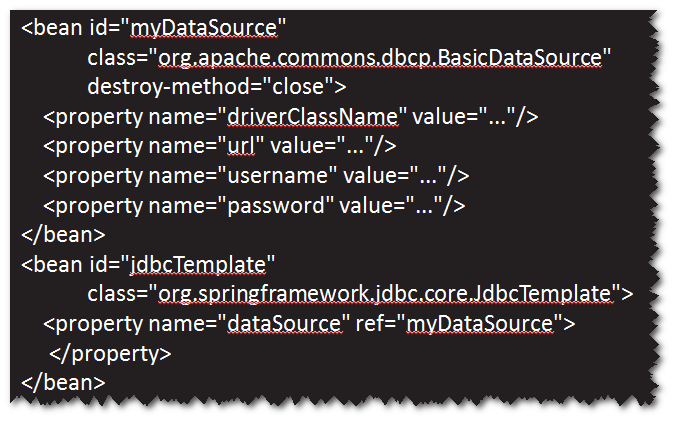

# 1. spring异常处理
## 方式一  使用简单异常处理器

step1. 在配置文件当中，添加简单异常处理器。 

step2. 添加对应的异常处理页面。 
## 方式二 使用@ExceptionHandler
step1. 在处理器中添加一个异常处理方法，在该方法
前添加@ExceptionHandler。 

 
step2. 在异常处理方法当中，依据异常类型，分别
进行不同的处理。 
step3. 添加对应的异常处理页面。 
# 2. 表单中文参数值如何处理?
(1)乱码问题产生的原因
提交表单时，浏览器会对表单中的中文参数值进行
编码（浏览器会按照打开表单所在的页面时所使用的
字符集来编码），而服务器端默认使用"iso-8859-1"
来解码。 
(2)如何解决
在web.xml文件，配置CharacterEncodingFilter过滤器
（该过滤器由spring提供）。 
 
注意： 
a.表单提交方式必须为post方式。 
b.页面编码与过滤器所使用的编码要一致。

# 3. spring jdbc
## spring jdbc是什么?
spring对jdbc的封装，通过使用spring jdbc来访问数据库，
就不再需要考虑获取连接与关闭连接等问题。 
## 如何使用spring jdbc?   
step1. 导包。 
spring-webmvc,spring-jdbc,ojdbc,dbcp,junit。 

 
step2. 添加spring配置文件。 
主要是两个配置 
a.连接池的配置。 
b.JdbcTemplate的配置。 

 
注:JdbcTemplate封装了常见的一些数据库操作(增删改查),
需要将连接池注入到JdbcTemplate。 
step3. 将JdbcTemplate注入到DAO，然后调用
JdbcTemplate提供的方法。 

create table emp(
	id number(8) primary key,
	ename varchar2(50),
    age number(3)
);
create sequence emp_seq;

