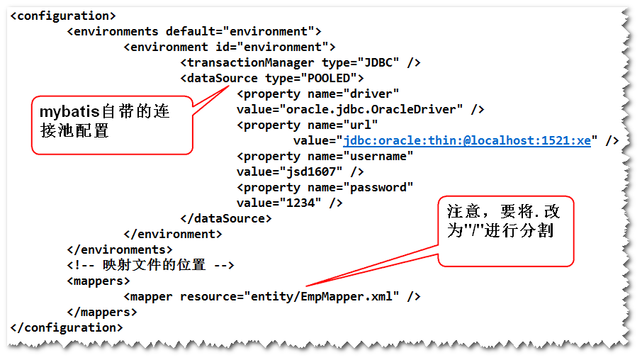
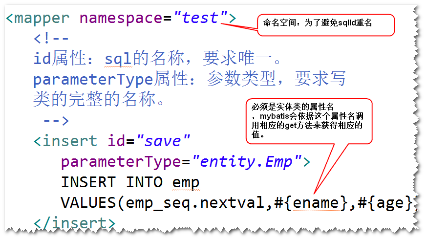
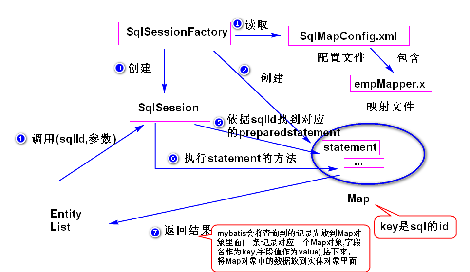
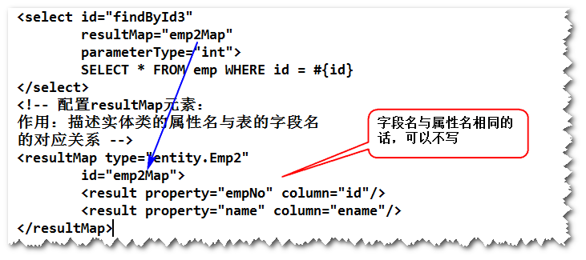

# 1. mybatis
## (1) mybatis是什么?
是一个开源的持久层框架。 
## (2) 如何使用mybatis?
step1. 导包。 
mybatis,ojdbc  
step2. 添加配置文件。 

 
step3. 写实体类。 
注：实体类的属性名与表的字段名要求一致（大小写可以
不一样）。 
step4. 写映射文件。 

 
注： 
a.insert元素用于添加操作，查询应该使用
select元素，修改使用update元素，删除使用
delete元素。 
b.这些元素可以使用的属性不同，
不要误用，比如添加操作使用select元素是不对的。
 
step5. 调用SqlSession提供的方法来访问数据库。 
## (3) mybatis实现原理

## (4) 返回Map类型的查询结果。
mybatis会将查询到的记录先放到Map对象里面(
一条记录对应一个Map对象,字段名作为key,
字段值作为value),接下来，将Map对象
中的数据放到实体对象里面。 
## （5）使用resultMap解决实体类的属性名与
表的字段名不一致的情况。 
step1.在映射文件当中，使用resultMap元素制定
实体类的属性名与表的字段名的对应关系。 
step2.查询语句当中，返回类型应该使用resultMap
元素来描述。 

 