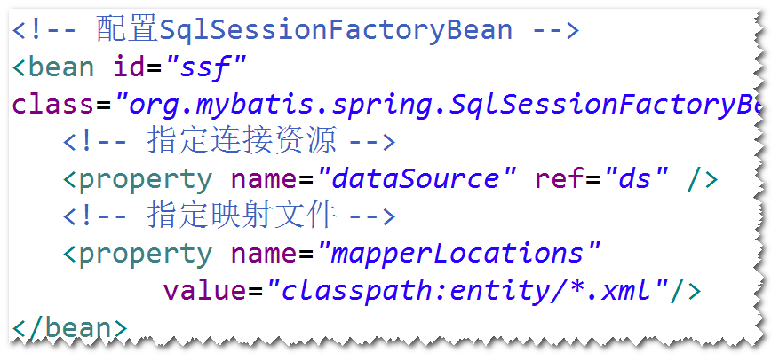
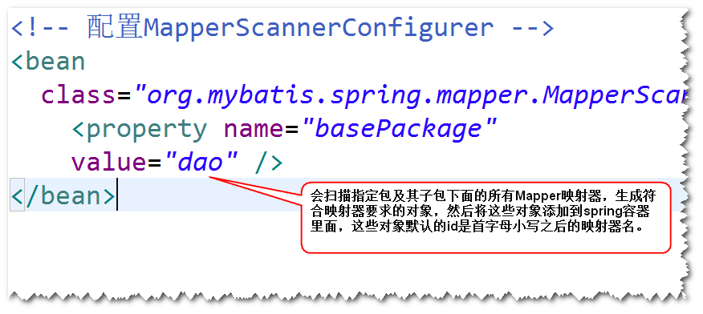
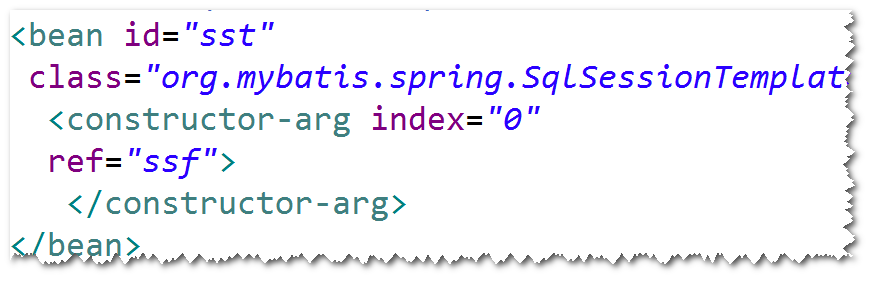
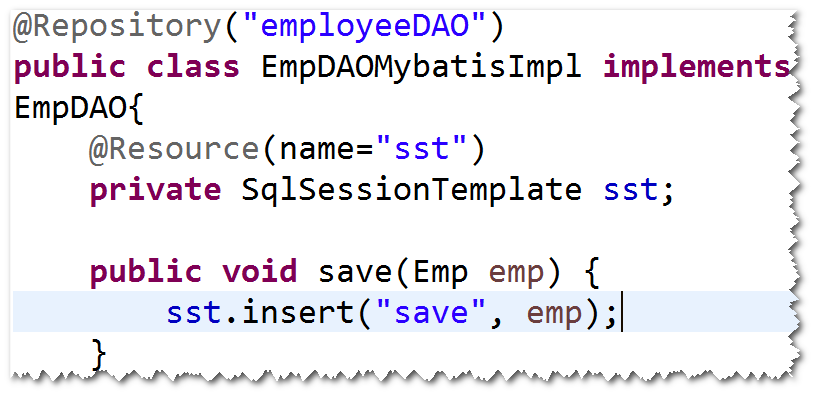

# 1. mapper映射器
## (1)mapper映射器是什么?
符合映射文件要求的接口。 
注：mybatis会依据mapper映射器，自动生成符合
其要求的对象。 
## (2)具体要求:
a. 方法名要与sqlId一致。 
b. 参数类型要与parameterType一致。 
c. 返回类型要与resultType一致。 
d. 映射文件的namespace必须等于mapper映射器的
完整的名字。 
## (3)编程步骤
step1. 写Mapper映射器。 
step2. 使用SqlSession提供的getMapper方法来获得
映射器的实现对象。 

# 2. spring集成mybatis
## (1)集成的好处：
a. 简化代码： 
比如，不用关心SqlSession如何获得和关闭。 
b. 可以使用依赖注入。 
可以将DAO注入到目标对象，比如将AdminDAO注入
到LoginController,方便代码的维护。 
## (2)如何集成?
step1. 导包。 
spring-webmvc(包含了spring核心包和springmvc),
mybatis,mybatis-spring(用于二者集成),
spring-jdbc, dbcp,ojdbc,junit。 
step2. 添加spring配置文件。 
注：不再需要mybatis的配置文件，只需要配置
SqlSessionFactoryBean就可以了。 

 
step3. 实体类  
step4. 映射文件  
step5. Mapper映射器(DAO)  
step6. 配置MapperScannerConfigurer。 
注：这个bean会创建SqlSession对象，另外，会调用
SqlSession对象的getMapper方法，来创建符合
映射器要求的对象，最后，将这些对象(即符合映射器要求)
放到spring容器里面(即可以调用容器提供的getBean方法
来获得这些对象，当然，也可以使用依赖注入)。 

注： 
a. 默认的id是首字母小写之后的映射器名。 
b. 可以使用@Respository对id进行命名。此时，
不需要配置组件扫描。 
c.如果只扫描特定的映射器，可以设置
MapperScannerConfigurer的annotationClass
属性。 
	c1.开发一个注解，比如@MyRepository。 
	c2.将该注解添加到要扫描的映射器。 
	c3.配置annotationClass属性。 

# 3. spring集成mybatis的另外一种方式(了解)。
step1. 导包。 
spring-webmvc(包含了spring核心包和springmvc),
mybatis,mybatis-spring(用于二者集成),
spring-jdbc, dbcp,ojdbc,junit。 
step2. 添加spring配置文件。 
注：不再需要mybatis的配置文件，只需要配置
SqlSessionFactoryBean就可以了。 

 
step3. 实体类  
step4. 映射文件  
step5. Mapper映射器(DAO)  
step6. 配置SqlSessionTemplate。 

 
step7. 写一个DAO实现类，将SqlSessionTemplate
注入到该类。 

 
  