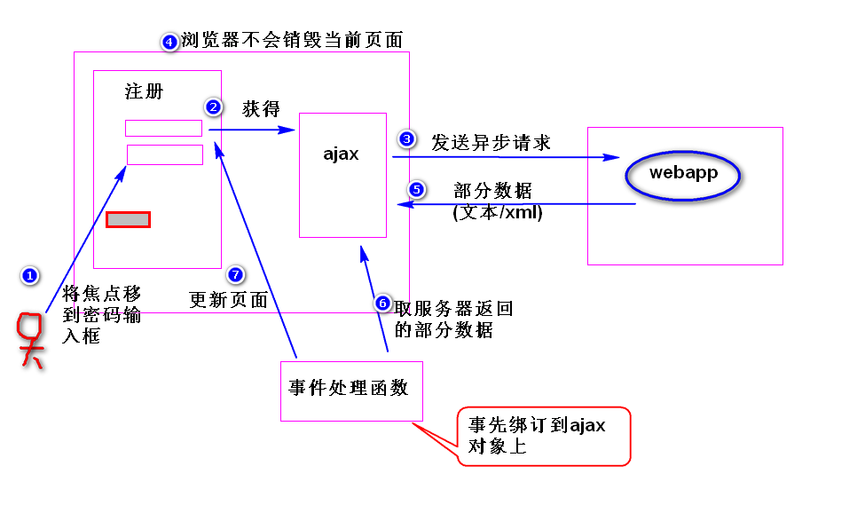
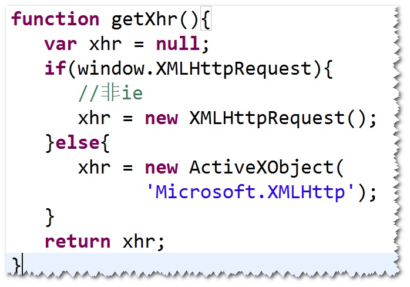
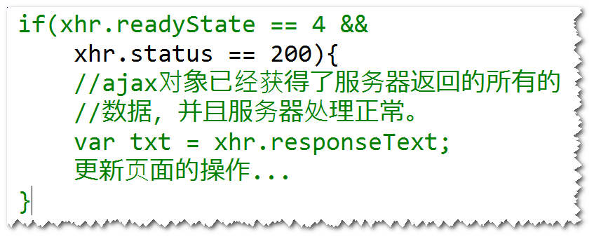

# ajax (asynchronous javascript and xml) 
## (1) ajax是什么?
是一种用来改善用户体验的技术，其实质是利用浏览器提供的
ajax对象（即XMLHttpRequest对象）异步地向服务器发送
请求,服务器送回部分数据，浏览器利用这些数据对当前页面
做部分更新，整个流程，页面无刷新，不打断用户的操作。

 
注： 
异步，指的是，当ajax对象发送请求时，浏览器不会销毁当前
页面，用户仍然可以对当前页面做其它操作。 
## (2)如何获得ajax对象
没有标准化，需要区分浏览器。 

 	
## (3) ajax对象的几个重要属性
a. onreadystatechange:绑订事件处理函数，用来处理
readystatechange事件。 
注：当ajax对象的readystate属性值发生改变，比如从
0变成了1，就会产生readystatechange事件。 
b. readyState:有五个值(0,1,2,3,4),表示ajax对象与
服务器通信的进展，其中4表示ajax对象已经获得了服务器
返回的所有的数据。 
c. responseText:获得服务器返回的文本数据。 
d. responseXML:获得服务器返回的xml文本数据。 
e. status:获得服务器返回的状态码。         

## (4)编程步骤
step1. 获得ajax对象。 
比如: 
var xhr = getXhr();  
step2. 使用ajax对象发送请求。 
方式一：发送get请求  
	xhr.open('get',
		'check_uname.do?uname=Sally',true);  
	xhr.onreadystatechange=f1;  
	xhr.send(null); 
方式二：发送post请求     
	xhr.open('post','check_uname.do',true); 
	xhr.setRequestHeader('content-type',
	'application/x-www-form-urlencoded'); 
	xhr.onreadystatechange=f1; 
	xhr.send('uname=sally');   
注1： 
true: 异步请求。  
false:同步请求(发送请求时，浏览器会锁定当前页面，用
户不能够对当前页面做其它操作)。 
注2： 
按照http协议要求，发送post请求时，请求数据包里面要
包含content-type消息头。默认情况下，ajax对象在发送
请求时，不会包含这个消息头，所以需要调用setRequestHeader
方法。 
step3. 编写服务器的程序，通过只需要返回部分数据。 
step4. 写事件处理函数。 
	

## (5)缓存问题
### 怎么产生的?
ie浏览器发送get请求时，会查看请求地址是否访问过，
如果访问过，则不再发送新的请求，而是显示第一次
返回的结果。 
### 如何解决?
在请求地址后面添加随机数。 
	

