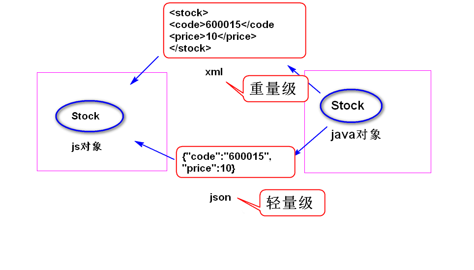

# 1. json (javascript object notation)
## (1)json是什么?    
是一种轻量级的数据交换格式。 
a. 数据交换: 
将数据转换成一种与平台无关的数据格式，发送给接收方来
处理。 
b. 轻量级: 
json相对xml而言，数据量更小，解析速度更快。 
## (2)基本语法
a. 如何表示一个对象?  
	{属性名：属性值，属性名：属性值...}  
注： 
属性名必须使用双引号括起来。 
属性值的类型可以是string,number,true/false,null,
object。 
属性值如果是string,必须使用双引号括起来。 
b. 如何表示由对象组成的数组? 
[{},{},{}...]  

## (3)使用json
a. 如何java对象转换成json字符串。 
使用json官方提供的工具(json-lib)。 
单个对象，使用JSONObject;多个对象组成的数组或者
集合使用JSONArray。 
b. 如何将json字符串转换成javascript对象?
使用prototype提供的工具。 

# 2. jQuery对ajax的支持
## $.ajax函数
(1)语法: 
	$.ajax({选项参数名:选项参数值,...});  
常见的选项参数： 
	url: 请求地址   
    type: 请求类型 (比如  get/post)  
    data: 请求参数，有两种格式： 
		第一种: 请求字符串形式，比如
			"username=Sally&age=22"  
		第二种：请求对象形式，比如
			{"username":"Sally","age":22}  
	dataType: 服务器端返回的数据类型: 
			json  (json字符串)   
			text  (文本)   
			html  (html内容)  
			xml   (xml文档)  
			script (javascript脚本)  
	success: 指定一个函数，用来处理服务器返回的
			数据。 
	error: 指定一个函数，用来处理服务器异常情况。
	async: 同步还是异步(缺省),false表示同步。
		

## load函数

	

			