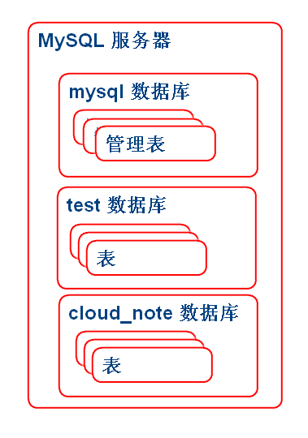
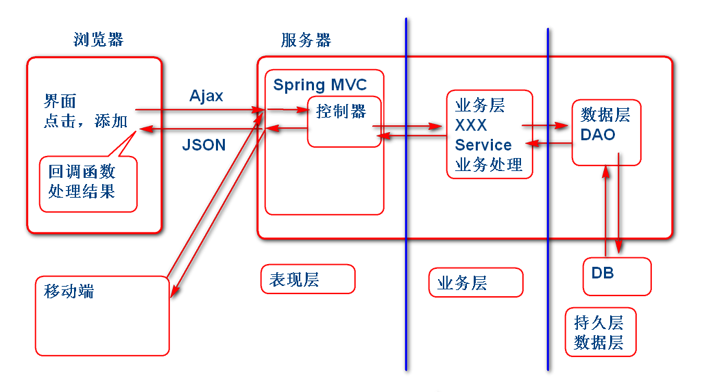

# 云笔记项目

开发步骤

1. 需求分析
2. 数据结构设计
	- 数据库表设计
3. 初始化数据库
4. 环境搭建
	- 导入包
	- 配置Spring MVC
	- 配置MyBatis
5. 设计数据层
6. 设计业务层
7. 实现软件功能...

## 1. 需求分析

从客户获取详细的软件需求

## 2. 数据结构设计

一般数据结果设计过程称为：实体-关系设计。依据软件的需求设计合理的存储结果存储需求中软件数据。可以概要设计，在实现软件过程中再逐步细化。

> 在工作中可以使用图形化建模工具,如： PowerBuilder ER工具，实体关系建模工具

E-R设计结果：

> ER图是利用"实体建模"工具绘制, 实体建模工具可以自动化的将 ER图 导出为 DDL SQL 语句

### 常见ER建模工具
	
1. Power Designer 
2. ER Studio

根据设计生成建表SQL。请参考  [cloud_note.sql](cloud_note.sql)

##3. 初始化数据库

### 3.1 MySQL 常用操作

使用MySQL作为数据库

连接到数据库，打开终端窗口：
	
	mysql -uroot -p	

> 其中 -uroot 表示使用 root 用户登录 -p 表示输入用户密码，Linux教学系统默认没有密码，如果是Windows系统，请使用安装时候输入的密码。

MySQL的结构

	

MySQL 常用命令

创建数据库：

	create database 数据库名;

显示数据库列表：

	show databases;

删除数据库：

	drop database 数据库名;

切换（打开）当前数据库：

	use 数据库名;

显示全部表：

	show tables;

设置客户端的编码:

	set names utf8;

执行sql脚本

	source xxx.sql

### 3.2 项目sql脚本导入

将项目的sql脚本导入到数据库：
	
	set names utf8;
	create database cloud_note;
	use cloud_note;  
	source /home/soft01/cloud_note.sql

> 注意：cloud_note.sql 的位置, 错误的话就不能执行了。

执行建表的SQL语句：
	
	Windows: 
	source D:\tts9\note_ziliao\cloud_note.sql

	Linux:
	source /home/soft01/cloud_note.sql

## 4. Java环境搭建

需要组件

1. Spring 
2. SpringMVC
3. MyBatis
4. MyBatis-Spring
5. mysql-jdbc
6. dbcp
7. jackson
8. spring-jdbc
9. junit

### 4.1 导入包 pom.xml

pom.xml:
	
	  	<dependency>
	  		<groupId>org.springframework</groupId>
	  		<artifactId>spring-core</artifactId>
	  		<version>3.2.8.RELEASE</version>
	  	</dependency>
	  	<dependency>
	  		<groupId>org.springframework</groupId>
	  		<artifactId>spring-webmvc</artifactId>
	  		<version>3.2.8.RELEASE</version>
	  	</dependency>
	  	<dependency>
	  		<groupId>org.mybatis</groupId>
	  		<artifactId>mybatis</artifactId>
	  		<version>3.2.8</version>
	  	</dependency>
	  	<dependency>
	  		<groupId>org.mybatis</groupId>
	  		<artifactId>mybatis-spring</artifactId>
	  		<version>1.2.3</version>
	  	</dependency>
	  	<dependency>
	  		<groupId>mysql</groupId>
	  		<artifactId>mysql-connector-java</artifactId>
	  		<version>5.1.24</version>
	  	</dependency>
	  	<dependency>
	  		<groupId>commons-dbcp</groupId>
	  		<artifactId>commons-dbcp</artifactId>
	  		<version>1.4</version>
	  	</dependency>
	  	<dependency>
	  		<groupId>com.fasterxml.jackson.core</groupId>
	  		<artifactId>jackson-core</artifactId>
	  		<version>2.2.3</version>
	  	</dependency>
	  	<dependency>
	  		<groupId>com.fasterxml.jackson.core</groupId>
	  		<artifactId>jackson-databind</artifactId>
	  		<version>2.2.3</version>
	  	</dependency>
	  	<dependency>
	  		<groupId>com.fasterxml.jackson.core</groupId>
	  		<artifactId>jackson-annotations</artifactId>
	  		<version>2.2.3</version>
	  	</dependency>
	  	<dependency>
	  		<groupId>junit</groupId>
	  		<artifactId>junit</artifactId>
	  		<version>4.12</version>
	  	</dependency>
	  	<dependency>
	  		<groupId>org.springframework</groupId>
	  		<artifactId>spring-jdbc</artifactId>
	  		<version>3.2.8.RELEASE</version>
	  	</dependency>

### 4.2 配置Spring MVC
	
web.xml

	<servlet>
		<servlet-name>mvc</servlet-name>
		<servlet-class>
			org.springframework.web.servlet.DispatcherServlet
		</servlet-class>
		<init-param>
			<param-name>contextConfigLocation</param-name>
			<param-value>classpath:spring-*.xml</param-value>
		</init-param>
		<load-on-startup>1</load-on-startup>
	</servlet>
	
	<servlet-mapping>
		<servlet-name>mvc</servlet-name>
		<url-pattern>*.do</url-pattern>
	</servlet-mapping>

### 4.3 配置Spring

在 resource 文件夹中创建Spring配置文件 
1. spring-mybatis.xml MyBatis 配置
2. spring-servcie.xml 业务层 配置
3. spring-web.xml Spring-MVC 配置

spring-mybatis.xml:
	
	<?xml version="1.0" encoding="UTF-8"?>
	<beans xmlns="http://www.springframework.org/schema/beans" 
		xmlns:xsi="http://www.w3.org/2001/XMLSchema-instance"
		xmlns:context="http://www.springframework.org/schema/context" 
		xmlns:jdbc="http://www.springframework.org/schema/jdbc"  
		xmlns:jee="http://www.springframework.org/schema/jee" 
		xmlns:tx="http://www.springframework.org/schema/tx"
		xmlns:aop="http://www.springframework.org/schema/aop" 
		xmlns:mvc="http://www.springframework.org/schema/mvc"
		xmlns:util="http://www.springframework.org/schema/util"
		xmlns:jpa="http://www.springframework.org/schema/data/jpa"
		xsi:schemaLocation="
			http://www.springframework.org/schema/beans http://www.springframework.org/schema/beans/spring-beans-3.2.xsd
			http://www.springframework.org/schema/context http://www.springframework.org/schema/context/spring-context-3.2.xsd
			http://www.springframework.org/schema/jdbc http://www.springframework.org/schema/jdbc/spring-jdbc-3.2.xsd
			http://www.springframework.org/schema/jee http://www.springframework.org/schema/jee/spring-jee-3.2.xsd
			http://www.springframework.org/schema/tx http://www.springframework.org/schema/tx/spring-tx-3.2.xsd
			http://www.springframework.org/schema/data/jpa http://www.springframework.org/schema/data/jpa/spring-jpa-1.3.xsd
			http://www.springframework.org/schema/aop http://www.springframework.org/schema/aop/spring-aop-3.2.xsd
			http://www.springframework.org/schema/mvc http://www.springframework.org/schema/mvc/spring-mvc-3.2.xsd
			http://www.springframework.org/schema/util http://www.springframework.org/schema/util/spring-util-3.2.xsd">
		<!-- spring-mybatis.xml -->
		<!-- 配置数据源、连接池 -->
		<!-- Mybatis 的 sqlSessionFactory-->
		<!-- Mapper 接口自动扫描 -->
		
		<!-- 配置数据源连接池 -->
		<bean id="dataSource" class="org.apache.commons.dbcp.BasicDataSource"> 
			<property name="driverClassName" value="com.mysql.jdbc.Driver" />
			<property name="url" value="jdbc:mysql://localhost:3306/cloud_note" />
			<property name="username" value="root" />
			<property name="password" value="123456" />
			<property name="maxActive" value="50" />
		</bean>
		
		<!-- sessionFactory -->
		<bean id="sqlSessionFactory" class="org.mybatis.spring.SqlSessionFactoryBean">
			<property name="dataSource" ref="dataSource"/>
			<!-- resource:/mapper/UserMapper.xml -->
			<!-- 
			<property name="mapperLocations" 
				value="classpath:mapper/*.xml" />
			-->
		</bean>
		
		<!-- 配置Mapper接口扫描 -->
		<bean id="mapperScanner" class="org.mybatis.spring.mapper.MapperScannerConfigurer">
			<!-- 扫描cn.tedu.note.dao中的mapper接口 -->
			<property name="basePackage"  value="cn.tedu.note.dao" />
		</bean>
		 
	</beans>

spring-servcie.xml:

	<?xml version="1.0" encoding="UTF-8"?>
	<beans xmlns="http://www.springframework.org/schema/beans" 
		xmlns:xsi="http://www.w3.org/2001/XMLSchema-instance"
		xmlns:context="http://www.springframework.org/schema/context" 
		xmlns:jdbc="http://www.springframework.org/schema/jdbc"  
		xmlns:jee="http://www.springframework.org/schema/jee" 
		xmlns:tx="http://www.springframework.org/schema/tx"
		xmlns:aop="http://www.springframework.org/schema/aop" 
		xmlns:mvc="http://www.springframework.org/schema/mvc"
		xmlns:util="http://www.springframework.org/schema/util"
		xmlns:jpa="http://www.springframework.org/schema/data/jpa"
		xsi:schemaLocation="
			http://www.springframework.org/schema/beans http://www.springframework.org/schema/beans/spring-beans-3.2.xsd
			http://www.springframework.org/schema/context http://www.springframework.org/schema/context/spring-context-3.2.xsd
			http://www.springframework.org/schema/jdbc http://www.springframework.org/schema/jdbc/spring-jdbc-3.2.xsd
			http://www.springframework.org/schema/jee http://www.springframework.org/schema/jee/spring-jee-3.2.xsd
			http://www.springframework.org/schema/tx http://www.springframework.org/schema/tx/spring-tx-3.2.xsd
			http://www.springframework.org/schema/data/jpa http://www.springframework.org/schema/data/jpa/spring-jpa-1.3.xsd
			http://www.springframework.org/schema/aop http://www.springframework.org/schema/aop/spring-aop-3.2.xsd
			http://www.springframework.org/schema/mvc http://www.springframework.org/schema/mvc/spring-mvc-3.2.xsd
			http://www.springframework.org/schema/util http://www.springframework.org/schema/util/spring-util-3.2.xsd">
		
		 
	</beans>

spring-web.xml:

	<?xml version="1.0" encoding="UTF-8"?>
	<beans xmlns="http://www.springframework.org/schema/beans" 
		xmlns:xsi="http://www.w3.org/2001/XMLSchema-instance"
		xmlns:context="http://www.springframework.org/schema/context" 
		xmlns:jdbc="http://www.springframework.org/schema/jdbc"  
		xmlns:jee="http://www.springframework.org/schema/jee" 
		xmlns:tx="http://www.springframework.org/schema/tx"
		xmlns:aop="http://www.springframework.org/schema/aop" 
		xmlns:mvc="http://www.springframework.org/schema/mvc"
		xmlns:util="http://www.springframework.org/schema/util"
		xmlns:jpa="http://www.springframework.org/schema/data/jpa"
		xsi:schemaLocation="
			http://www.springframework.org/schema/beans http://www.springframework.org/schema/beans/spring-beans-3.2.xsd
			http://www.springframework.org/schema/context http://www.springframework.org/schema/context/spring-context-3.2.xsd
			http://www.springframework.org/schema/jdbc http://www.springframework.org/schema/jdbc/spring-jdbc-3.2.xsd
			http://www.springframework.org/schema/jee http://www.springframework.org/schema/jee/spring-jee-3.2.xsd
			http://www.springframework.org/schema/tx http://www.springframework.org/schema/tx/spring-tx-3.2.xsd
			http://www.springframework.org/schema/data/jpa http://www.springframework.org/schema/data/jpa/spring-jpa-1.3.xsd
			http://www.springframework.org/schema/aop http://www.springframework.org/schema/aop/spring-aop-3.2.xsd
			http://www.springframework.org/schema/mvc http://www.springframework.org/schema/mvc/spring-mvc-3.2.xsd
			http://www.springframework.org/schema/util http://www.springframework.org/schema/util/spring-util-3.2.xsd">
		
		 
	</beans>

测试案例:
	
	public class TestCase {
		
		ApplicationContext ctx;
		@Before
		public void init(){
			ctx = 
			new ClassPathXmlApplicationContext(
				"spring-mybatis.xml",
				"spring-service.xml");
		}
		@Test //测试MyBatis配置
		public void testMapperScanner(){
			Object obj = 
				ctx.getBean("mapperScanner");
			System.out.println(obj); 
		}
	}

> 如上测试如果通过说明, Spring MyBatis 和 MySQL 直接可以协调工作了.
	
## 5. 设计数据层

### 5.1 设计实体

User.java

	public class User implements Serializable{
		
		private String id;
		private String name;
		private String password;
		private String token;
		private String nick;
		
		public User() {
		}
	
		public User(String id, String name, String password, String token, String nick) {
			super();
			this.id = id;
			this.name = name;
			this.password = password;
			this.token = token;
			this.nick = nick;
		}
	
		public String getId() {
			return id;
		}
	
		public void setId(String id) {
			this.id = id;
		}
	
		public String getName() {
			return name;
		}
	
		public void setName(String name) {
			this.name = name;
		}
	
		public String getPassword() {
			return password;
		}
	
		public void setPassword(String password) {
			this.password = password;
		}
	
		public String getToken() {
			return token;
		}
	
		public void setToken(String token) {
			this.token = token;
		}
	
		public String getNick() {
			return nick;
		}
	
		public void setNick(String nick) {
			this.nick = nick;
		}
	
		@Override
		public String toString() {
			return "User [id=" + id + ", name=" + name + ", password=" + password + ", token=" + token + ", nick=" + nick
					+ "]";
		}
	
		@Override
		public int hashCode() {
			final int prime = 31;
			int result = 1;
			result = prime * result + ((id == null) ? 0 : id.hashCode());
			return result;
		}
	
		@Override
		public boolean equals(Object obj) {
			if (this == obj)
				return true;
			if (obj == null)
				return false;
			if (getClass() != obj.getClass())
				return false;
			User other = (User) obj;
			if (id == null) {
				if (other.id != null)
					return false;
			} else if (!id.equals(other.id))
				return false;
			return true;
		}
	}

> 注意: 有ID的实体类一般要实现 equals 和 hashCode 方法。

### 5.2 设计实体访问接口

UserDao.java

	package cn.tedu.note.dao;
	
	import cn.tedu.note.entity.User;
	
	public interface UserDao {
		void saveUser(User user);
		User findUserById(String id);
	}

> 注意： 实体访问接口的包，要与spring-mybatis.xml中配置的mapper接口扫描位置要一致。

spring-mybatis.xml：

	<!-- 配置Mapper接口扫描 -->
	<bean id="mapperScanner" class="org.mybatis.spring.mapper.MapperScannerConfigurer">
		<!-- 扫描cn.tedu.note.dao中的mapper接口 -->
		<property name="basePackage" value="cn.tedu.note.dao" />
	</bean>

### 5.3 利用MyBatis实现访问接口

添加Mapper映射xml文件实现访问接口：

mapper/UserMapper.xml:

	<?xml version="1.0" encoding="UTF-8" ?>  
	<!DOCTYPE mapper PUBLIC "-//ibatis.apache.org//DTD Mapper 3.0//EN"      
	 "http://ibatis.apache.org/dtd/ibatis-3-mapper.dtd">
	<mapper namespace="cn.tedu.note.dao.UserDao">
		<insert id="saveUser" 
		parameterType="cn.tedu.note.entity.User">
			insert into cn_user
				(cn_user_id, 
				cn_user_name,
				cn_user_password,
				cn_user_token,
				cn_user_nick)
			values
				(#{id}, #{name}, #{password}, #{token}, #{nick})		
		</insert>
	
		<select id="findUserById"
			parameterType="string"
			resultType="cn.tedu.note.entity.User">
			select 
				cn_user_id as id,
				cn_user_name as name,
				cn_user_password as password,
				cn_user_token as token,
				cn_user_nick as nick
			from
				cn_user
			where	
				cn_user_id=#{id}
		</select>	
	</mapper>

> 注意：UserMapper.xml 的存储位置要与spring-mybatis.xml 中配置对应

spring-mybatis.xml：

	<!-- sessionFactory -->
	<bean id="sqlSessionFactory" class="org.mybatis.spring.SqlSessionFactoryBean">
		<property name="dataSource" ref="dataSource"/>
		<!-- resource:/mapper/UserMapper.xml -->
		<property name="mapperLocations" value="classpath:mapper/*.xml" />
	</bean>

### 5.4 测试实体访问接口

利用JUnit 测试：

	public class TestCase {
		
		ApplicationContext ctx;
		@Before
		public void init(){
			ctx = 
			new ClassPathXmlApplicationContext(
				"spring-mybatis.xml",
				"spring-service.xml");
		}
		//@Test //测试MyBatis配置
		public void testMapperScanner(){
			Object obj = 
				ctx.getBean("mapperScanner");
			System.out.println(obj); 
		}
		//@Test//测试UserDAO的Save方法
		public void testSaveUser(){
			UserDao dao = 
				ctx.getBean(
				"userDao", UserDao.class);
			System.out.println(dao);
			String id=UUID.randomUUID().toString();
			System.out.println(id);
			User user=new User(
				id,"Tom","123","","Tomcat");
			dao.saveUser(user); 
		}
		
		@Test
		public void testFindUserById(){
			String id="8a9875ab-0af9-4a0b-a605-e3b30c29f3c4";
			UserDao dao = 
				ctx.getBean("userDao", UserDao.class);
			User user=dao.findUserById(id);
			System.out.println(user); 
		}
	}

> 逐个测试每个方法，测试结果到数据库中查询。

##　Ｇｏｏｄ　Ｌｕｃｋ！！

