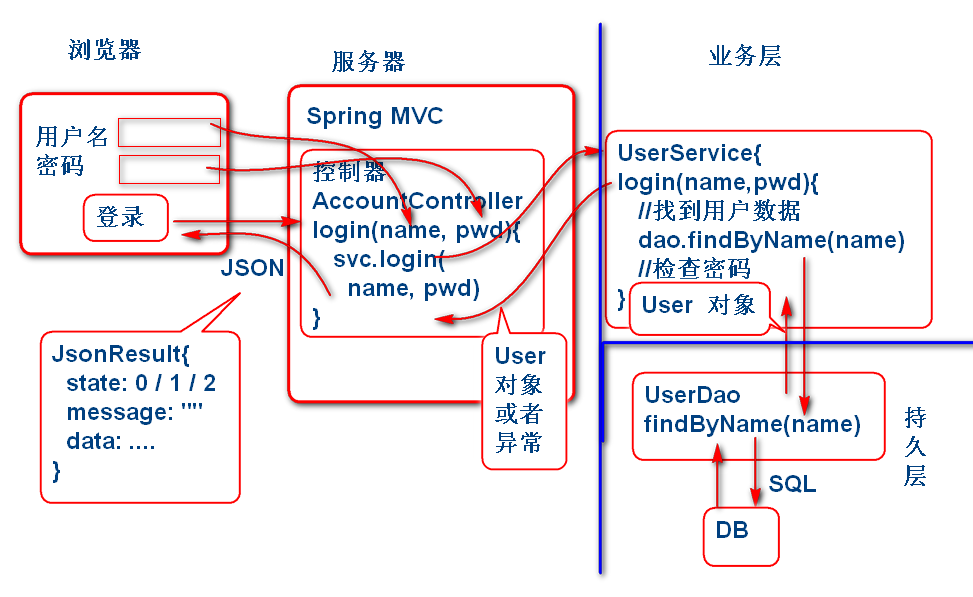

# 云笔记

## MyBatis 基本功能测试

## 1. 设计数据层

### 1.1 设计实体

User.java

	public class User implements Serializable{
		
		private String id;
		private String name;
		private String password;
		private String token;
		private String nick;
		
		public User() {
		}
	
		public User(String id, String name, String password, String token, String nick) {
			super();
			this.id = id;
			this.name = name;
			this.password = password;
			this.token = token;
			this.nick = nick;
		}
	
		public String getId() {
			return id;
		}
	
		public void setId(String id) {
			this.id = id;
		}
	
		public String getName() {
			return name;
		}
	
		public void setName(String name) {
			this.name = name;
		}
	
		public String getPassword() {
			return password;
		}
	
		public void setPassword(String password) {
			this.password = password;
		}
	
		public String getToken() {
			return token;
		}
	
		public void setToken(String token) {
			this.token = token;
		}
	
		public String getNick() {
			return nick;
		}
	
		public void setNick(String nick) {
			this.nick = nick;
		}
	
		@Override
		public String toString() {
			return "User [id=" + id + ", name=" + name + ", password=" + password + ", token=" + token + ", nick=" + nick
					+ "]";
		}
	
		@Override
		public int hashCode() {
			final int prime = 31;
			int result = 1;
			result = prime * result + ((id == null) ? 0 : id.hashCode());
			return result;
		}
	
		@Override
		public boolean equals(Object obj) {
			if (this == obj)
				return true;
			if (obj == null)
				return false;
			if (getClass() != obj.getClass())
				return false;
			User other = (User) obj;
			if (id == null) {
				if (other.id != null)
					return false;
			} else if (!id.equals(other.id))
				return false;
			return true;
		}
	}

> 注意: 有ID的实体类一般要实现 equals 和 hashCode 方法。

### 1.2 设计实体访问接口

UserDao.java

	package cn.tedu.note.dao;
	
	import cn.tedu.note.entity.User;
	
	public interface UserDao {
		void saveUser(User user);
	}

> 注意： 实体访问接口的包，要与spring-mybatis.xml中配置的mapper接口扫描位置要一致。

spring-mybatis.xml：

	<!-- 配置Mapper接口扫描 -->
	<bean id="mapperScanner" class="org.mybatis.spring.mapper.MapperScannerConfigurer">
		<!-- 扫描cn.tedu.note.dao中的mapper接口 -->
		<property name="basePackage" value="cn.tedu.note.dao" />
	</bean>

### 1.3 利用MyBatis实现访问接口

添加Mapper映射xml文件实现访问接口：

mapper/UserMapper.xml:

	<?xml version="1.0" encoding="UTF-8" ?>  
	<!DOCTYPE mapper PUBLIC "-//ibatis.apache.org//DTD Mapper 3.0//EN"      
	 "http://ibatis.apache.org/dtd/ibatis-3-mapper.dtd">
	<mapper namespace="cn.tedu.note.dao.UserDao">
		<insert id="saveUser" 
		parameterType="cn.tedu.note.entity.User">
			insert into cn_user
				(cn_user_id, 
				cn_user_name,
				cn_user_password,
				cn_user_token,
				cn_user_nick)
			values
				(#{id}, #{name}, #{password}, #{token}, #{nick})		
		</insert>
	
		 
	</mapper>

> 注意：UserMapper.xml 的存储位置要与spring-mybatis.xml 中配置对应

spring-mybatis.xml：

	<!-- sessionFactory -->
	<bean id="sqlSessionFactory" class="org.mybatis.spring.SqlSessionFactoryBean">
		<property name="dataSource" ref="dataSource"/>
		<!-- resource:/mapper/UserMapper.xml -->
		<property name="mapperLocations" value="classpath:mapper/*.xml" />
	</bean>

### 1.4 测试实体访问接口

利用JUnit 测试：

	public class TestCase {
		
		ApplicationContext ctx;
		@Before
		public void init(){
			ctx = 
			new ClassPathXmlApplicationContext(
				"spring-mybatis.xml",
				"spring-service.xml");
		}
		@Test //测试MyBatis配置
		public void testMapperScanner(){
			Object obj = 
				ctx.getBean("mapperScanner");
			System.out.println(obj); 
		}
		@Test//测试UserDAO的Save方法
		public void testSaveUser(){
			UserDao dao = 
				ctx.getBean(
				"userDao", UserDao.class);
			System.out.println(dao);
			String id=UUID.randomUUID().toString();
			System.out.println(id);
			User user=new User(
				id,"Tom","123","","Tomcat");
			dao.saveUser(user); 
		}
	}

> 逐个测试每个方法，测试结果到数据库中查询。

## 2. 登录功能

### 2.1 登录功能 设计

根据业务功能，映射到软件的架构中的各个层次，设计如下：

### 2.2 登录数据层 实现

在UserDAO接口中添加findUserByName方法：

	public interface UserDao {
		void saveUser(User user);
		User findUserById(String id);
		User findUserByName(String name);
	}

在MyBatis UserMapper.xml 文件中添加SQL语句：

	<select id="findUserByName"
		parameterType="string"
		resultType="cn.tedu.note.entity.User">
		select 
			cn_user_id as id,
			cn_user_name as name,
			cn_user_password as password,
			cn_user_token as token,
			cn_user_nick as nick
		from
			cn_user
		where	
			cn_user_name=#{name}
	</select>	

在TestCase中添加测试案例，测试findUserByName方法

	@Test
	public void testFindUserByName(){
		String name = "Tom";
		UserDao dao = ctx.getBean( "userDao", UserDao.class);
		User user=dao.findUserByName(name);
		System.out.println(user); 
	}

### 2.3 登录业务层 实现

添加业务层接口UserService.java：

	public interface UserService extends Serializable{
		
		/**
		 * 登录方法
		 * @param name 用户名
		 * @param password 密码
		 * @return 登录成功时候返回用户的信息
		 * @throws NameOrPasswrodException 
		 * 			用户名或密码错误
		 * 			用户名或密码为空
		 */
		User login(String name,String password) throws NameOrPasswordException;
	}

实现登录功能 UserServiceImpl：
	
	@Service("userService")
	public class UserServiceImpl implements UserService{
		
		private static final long serialVersionUID = -2319034197248489962L;
		
		@Autowired
		private UserDao userDao;
		
		public User login( String name, String password) throws NameOrPasswordException {
			//入口参数检查
			if(name==null || name.trim().isEmpty()){
				throw new NameOrPasswordException("用户名不能为空");
			}
			if(password==null || password.trim().isEmpty()){
				throw new NameOrPasswordException("密码不能为空");
			}
			//从业务层查询用户信息
			User user=userDao.findUserByName(name);
			if(user==null){
				throw new NameOrPasswordException("用户名或者密码错误");
			}
			if(user.getPassword().equals(password)){
				return user;//登录成功
			}
			throw new NameOrPasswordException("用户名或者密码错误");
		}
	}

更新Spring配置文件，扫描业务层组件 spring-service.xml:

	<!-- spring-service.xml -->
	<context:component-scan base-package="cn.tedu.note.service"/>

添加测试案例测试登录功能：

	@Test
	public void testLogin(){
		String name="Tom";
		String password = "123";
		UserService service = ctx.getBean("userService", UserService.class);
		User user = service.login(name, password);
		System.out.println(user); 
		//异常的登录测试
		user = service.login(name, "1234");
	}

### 2.4 实现登录控制器

添加JsonResult类，用于封装Json返回值：
	
	/**
	 * 用于封装服务器到客户端的Json返回值
	 */
	public class JsonResult<T> 
		implements Serializable{
		public static final int SUCCESS=0;
		public static final int ERROR=1;
		
		private int state;
		private String message = "";
		private T data;
		
		public JsonResult() {
			state = SUCCESS;
		}
		//为了方便,重载n个构造器
		public JsonResult(
			int state, String message, T data) {
			this.state = state;
			this.message = message;
			this.data = data;
		}
		public JsonResult(String error){
			this(ERROR, error, null);
		}
		public JsonResult(T data){
			this(SUCCESS, "", data);
		}
		public JsonResult(int state){
			this(state, "", null);
		}
		public JsonResult(Throwable e){
			this(ERROR, e.getMessage(), null);
		}
		public int getState() {
			return state;
		}
		public void setState(int state) {
			this.state = state;
		}
		public String getMessage() {
			return message;
		}
		public void setMessage(String message) {
			this.message = message;
		}
		public T getData() {
			return data;
		}
		public void setData(T data) {
			this.data = data;
		}
		@Override
		public String toString() {
			return "JsonResult [state=" + state + ", message=" + message + ", data=" + data + "]";
		}
		
	}
	
增加控制器用于处理Web请求： AccountController.java

	@Controller
	@RequestMapping("/account")
	public class AccountController {
		
		@Autowired
		private UserService userService;
		
		@RequestMapping("/login.do")
		@ResponseBody
		public JsonResult<User> login(
			String name, String password){
			try{
				User user=userService.login(
						name, password);
				return new JsonResult<User>(user);
			}catch(Exception e){
				e.printStackTrace();
				return new JsonResult<User>(e);
			}
		}
	}

更新 spring-web.xml 配置文件增加如下内容：

	<!-- spring-web.xml -->
	<context:component-scan base-package="cn.tedu.note.web"/>
	<mvc:annotation-driven/>

将项目部署在Tomcat服务器上测试：

	访问：
	http://localhost:8080/note/account/login.do?name=Tom&password=123

	返回：
	{"state":0,"message":"","data":{"id":"1","name":"Tom","password":"123","token":"","nick":"Tomcat"}}

	
	
	
	
	
	
	
	
	
	
	

