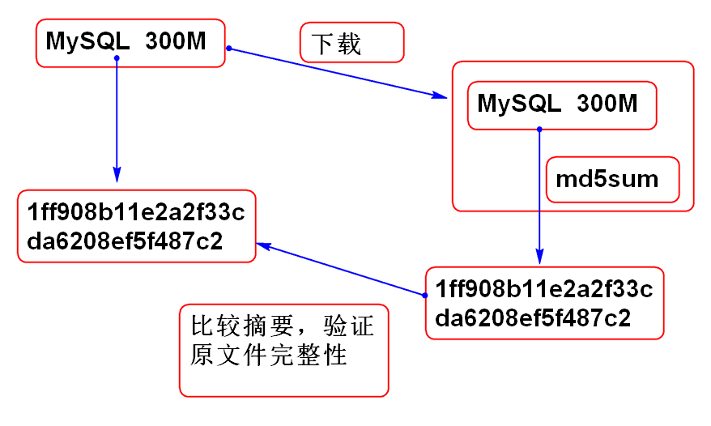
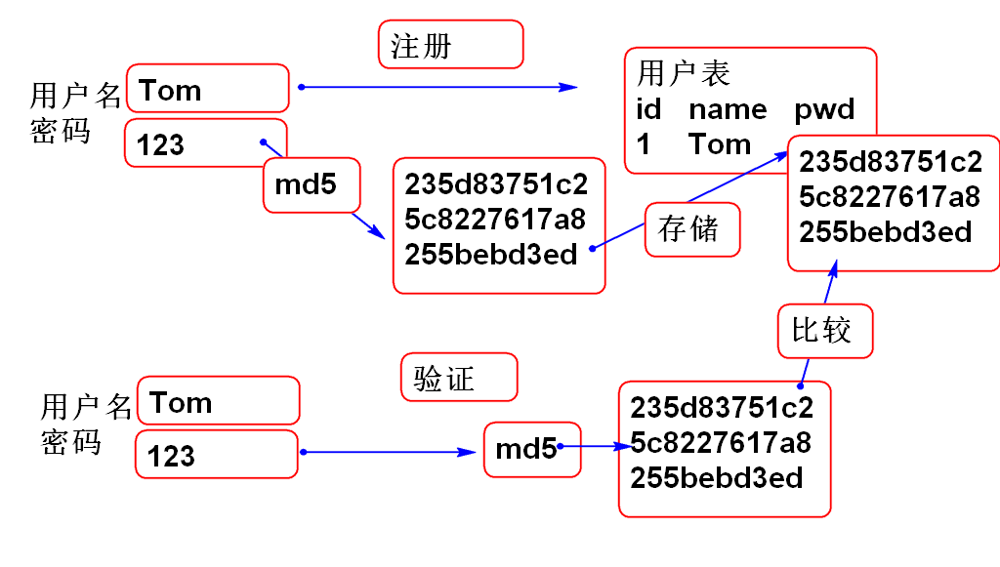
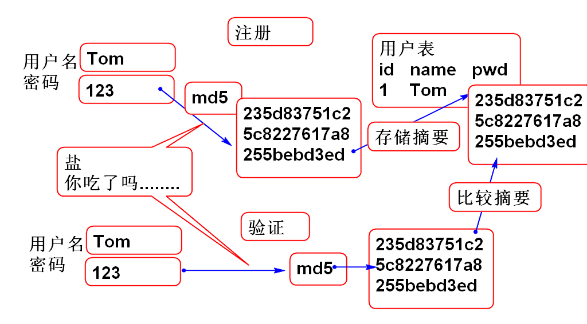
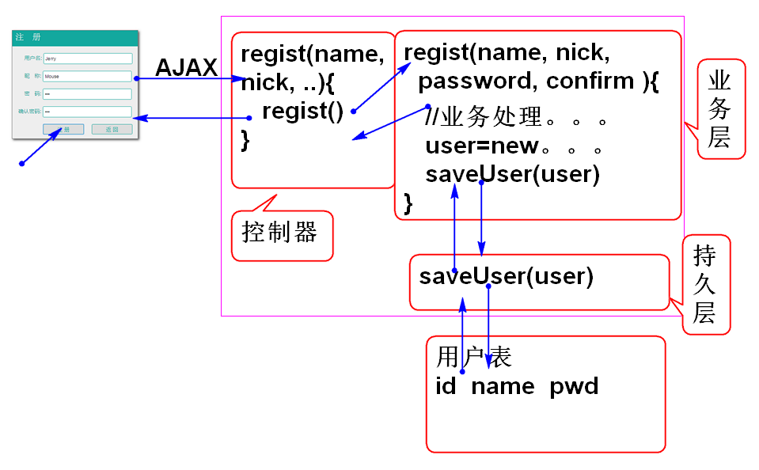

# 云笔记

## 密码的加密处理

业界原则： 密码不能明文保存！！！

> 明文： 原始数据， 密文：原始数据经过计算得到的加密数据

### 消息摘要技术

常用算法： MD5  SHA-1 等

消息摘要结果特定: 

1. 同样数据的摘要结果一定相同
2. 摘要结果一样，其数据一定一样

如：

	md5sum readme.txt passwd.csv nexus.conf.tar.gz

	4983b761596da1a8296a5e16d94a5f75  readme.txt
	235d83751c25c8227617a8255bebd3ed  passwd.csv
	525d172647acf4d1879327e0c5d7276a  nexus.conf.tar.gz

摘要用途: 验证数据的完整性

### 利用摘要加密密码

直接摘要存储：

原理：

> 缺点：简单摘要不能解决被反查问题，可以在一些网站上反查简单数据的摘要。

加盐摘要：

原理：

> 可以避免被反查

实现密码加密：

导入 Commons-codec 包

	<dependency>
		<groupId>commons-codec</groupId>
		<artifactId>commons-codec</artifactId>
		<version>1.10</version>
	</dependency>

测试：

	@Test
	public void testMd5(){
		String str = "12345678你好";
		String md5 = 
			DigestUtils.md5Hex(str);
		System.out.println(md5); 
	}
	
	@Test
	public void testSaltPwd()
		throws Exception {
		String pwd = "123";
		String salt = "你吃了吗？";
		String s = 
			DigestUtils.md5Hex(pwd+salt);
		System.out.println(s);
		//2625eadfbe7fa3168f8e9cafa28aaa44
		
		//update cn_user set cn_user_password = 
		// '2625eadfbe7fa3168f8e9cafa28aaa44'
	}

将数据中的全部密码重置为123：

	update cn_user set cn_user_password=	 '2625eadfbe7fa3168f8e9cafa28aaa44';
	
添加加密工具类：

	public class Utils {
		
		private static final String salt = "你吃了吗？";
		
		public static String crypt(String pwd){
			return DigestUtils.md5Hex(pwd+salt);
		}
	}

更新登录算法 UserServiceImpl 的 login 方法：

	//比较摘要
	String md5=Utils.crypt(password);
	System.out.println(md5);
	System.out.println(user);
	if(user.getPassword().equals(md5)){
		//业务处理
		//登录成功，返回用户信息
		return user;
	}

测试：用户可以正常登录。

**经典面试题**: 是否可以在Cookie中保存密码等敏感信息
	
	答案： 
	不能直接明文保存密码等敏感信息到Cookie，
	如果实在需要保存可以进行加盐摘要处理以后再保存到cookies中。

## 注册功能

分析：

实现步骤：

1. 实现持久层并且测试
2. 实现业务层并且测试
3. 实现表现层控制器并且测试
4. 整合HTML界面

### 1. 实现持久层并且测试
	
已经实现，略.

### 2. 实现业务层并且测试

添加业务层接口方法， UserService.java：

	/**
	 * 用户注册功能
	 * 
	 * @throws UserNameException 用户名空，
	 *   或者已经注册
	 * @throws PasswordException 密码不一致
	 */
	public User regist(String name, 
			String nick, 
			String password,
			String confirm)
		throws UserNameException, 
		PasswordException;

实现业务层 UserServceImpl.java：

	public User regist(String name, String nick, 
			String password, String confirm)
			throws UserNameException, PasswordException {
		if(name==null||name.trim().isEmpty()){
			throw new UserNameException("不能空");
		}
		String reg = "^\\w{3,10}$";
		if(! name.matches(reg)){
			throw new UserNameException("不合规则");
		}
		if(nick==null||nick.trim().isEmpty()){
			nick = name;
		}
		if(password==null||password.trim().isEmpty()){
			throw new PasswordException("不能空");
		}
		password = password.trim();
		if(! password.matches(reg)){
			throw new UserNameException("密码不合规");
		}
		if(! password.equals(confirm)){
			throw new PasswordException("确认不一致");
		}
		name = name.trim();
		//检验用户名是否重复？
		User one=userDao.findUserByName(name);
		if(one!=null){
			throw new UserNameException("已注册");
		}
		// name, nick, password
		//UUID 用于生产永远不重复的ID
		String id=UUID.randomUUID().toString();
		String token="";
		String pwd=Utils.crypt(password);
		User user = new User(id, name, 
			pwd, token, nick);
		System.out.println(user);
		userDao.saveUser(user);
		return user;
	}

测试：

	@Test
	public void testRegistUser(){
		UserService service = 
			ctx.getBean("userService",
			UserService.class);
		User user=service.regist(
			"Jerry", "Mouse","123", "123");
		System.out.println(user); 
	}

### 3. 实现表现层控制器并且测试

添加控制器方法 UserController.java: 

	@RequestMapping("/regist.do")
	@ResponseBody
	public JsonResult<User> regist(
			String name, String nick, 
			String password, String confirm){
		User user = userService.regist(name, nick, password, confirm);
		return new JsonResult<User>(user);
	}

添加异常处理方法，进行统一异常处理：

	@ExceptionHandler(UserNameException.class)
	@ResponseBody
	public JsonResult userName(UserNameException e){
		e.printStackTrace();
		return new JsonResult(2, e);
	}
	@ExceptionHandler(PasswordException.class)
	public JsonResult password(PasswordException e){
		e.printStackTrace();
		return new JsonResult(3, e);
	}
	@ExceptionHandler
	@ResponseBody
	public JsonResult exp(Exception e){
		e.printStackTrace();
		return new JsonResult(e);
	}

> 利用@ExceptionHandler统一异的处理，可以简化控制器方法的书写。

重构登录控制器方法：

	@RequestMapping("/login.do")
	@ResponseBody
	public JsonResult<User> login(String name,
			String password){
		User user =  userService.login(name, password);
		return new JsonResult<User>(user);
	}

测试: 利用浏览器进行测试
	
	http://localhost:8080/note/user/regist.do?name=andy&nick=an&password=123&confirm=123

### 4. 整合HTML界面

绑定界面事件 login.js：

	$('#regist_button').click(registAction);
	$('#regist_username').blur(checkRegistUsername);
	$('#regist_password').blur(checkRegistPassword);
	$('#final_password').blur(checkFinalPassword);

添加表单失去焦点事件处理方法：

	function checkRegistUsername(){
		console.log("checkRegistUsername");
		var name=$('#regist_username').val();
		var reg = /^\w{3,10}$/;
		if(! reg.test(name)){
			$('#warning_1 span')
				.html("不合规则")
				.parent().show();
			return false;
		}
		$('#warning_1').hide();
		return true;
	}
	function checkRegistPassword(){
		console.log('checkRegistPassword');
		var pwd = $('#regist_password').val();
		var reg = /^\w{3,10}$/;
		if(! reg.test(pwd)){
			$('#warning_2 span').html('不合规则')
				.parent().show();
			return false;	
		}
		$('#warning_2').hide();
		return true;
	}
	function checkFinalPassword(){
		console.log("checkFinalPassword");
		var confirm = $('#final_password').val();
		var pwd = $('#regist_password').val();
		if(confirm != pwd){
			$('#warning_3 span').html('不一致')
				.parent().show();
			return false;	
		}
		$('#warning_3').hide();
		return true;
	}
	
添加 **注册** 点击事件处理方法
	
	function registAction(){
		console.log("registAction");
		var pass=checkRegistUsername()+
			checkRegistPassword()+
			checkFinalPassword();
		console.log('pass'+pass);
		if(pass!=3){
			//测试///
			return;
		}
		var url="user/regist.do";
		var name=$('#regist_username').val();
		var nick=$('#nickname').val();
		var pwd=$('#regist_password').val();
		var confirm=$('#final_password').val();
		//向服务器发送
		var data={name:name, nick:nick, 
				password:pwd, confirm:confirm};
		console.log("url:"+url);
		console.log("data:"+data);
		$.post(url, data, function(result){
			if(result.state==0){
				var user=result.data;
				console.log(user);
				$('#back').click();
				$('#count').val(user.name);
				$('#password').focus();
			}else if(result.state==2){
				$('#warning_1 span')
				.html(result.message)
				.parent().show();
			}else if(result.state==3){
				$('#warning_2 span')
				.html(result.message)
				.parent().show();
			}else{
				alert(result.message);
			}
		});
	} 

测试...

--------------------------------

## 作业

完成注册功能

