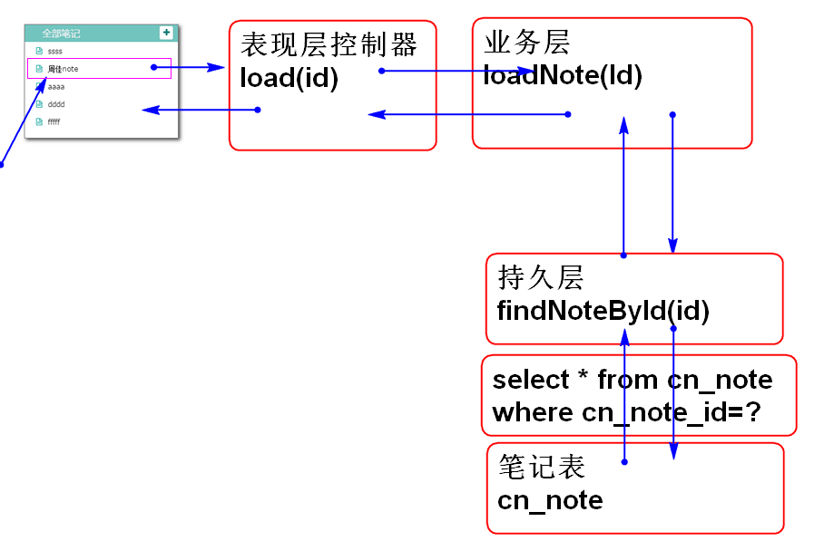
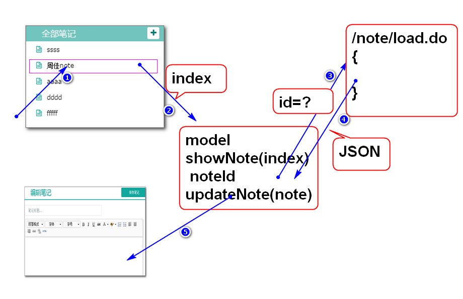

#云笔记

## 显示笔记

原理：

	

步骤：

1. 编写持久层方法并且测试
2. 编写业务层方法并且测试
3. 编写控制器方法并且测试
4. 编写JS发起Ajax请求，并且显示结果

### 1. 编写持久层方法并且测试

编写数据层方法 NoteDao.java:

	Note findNoteById(String id);

添加SQL语句 NoteMapper.xml:

	<select id="findNoteById"
		parameterType="string"
		resultType="cn.tedu.note.entity.Note">
		select
			cn_note_id as id,
			cn_notebook_id as notebookId,
			cn_user_id as userId,
			cn_note_status_id as statusId,
			cn_note_type_id as typeId,
			cn_note_title as title,
			cn_note_body as body,
			cn_note_create_time as createTime,
			cn_note_last_modify_time as lastModifyTime
		from
			cn_note 
		where
			cn_note_id=#{id}
	</select>

> 提示：由于SQL语句比较长， 建议先利用MySQL测试，使用测试通过的SQL语句。

测试：

	@Test
	public void testFindNoteById(){
		String id = "051538a6-0f8e-472c-8765-251a795bc88f";
		NoteDao dao = ctx.getBean(
			"noteDao", NoteDao.class);
		Note note = dao.findNoteById(id);
		System.out.println(note); 
	}

### 2. 编写业务层方法并且测试

编写业务层方法 NoteService.java:

	Note loadNote(String id)
		throws NoteNotFoundException;

实现业务层 NoteServiceImpl.java:

	public Note loadNote(String id)
			throws NoteNotFoundException {
		if(id==null||id.trim().isEmpty()){
			throw new NoteNotFoundException("ID空");
		}
		Note note = noteDao.findNoteById(id);
		if(note==null){
			throw new NoteNotFoundException("id错误");
		}
		return note;
	}

测试：

	
	@Test
	public void testLoadNote(){
		String id="051538a6-0f8e-472c-8765-251a795bc88f";
		NoteService noteService = 
			ctx.getBean("noteService",
			NoteService.class);
		Note note = noteService.loadNote(id);
		System.out.println(note); 
	}	

### 3. 编写控制器方法并且测试

编写控制器方法 NoteController.java:

	@RequestMapping("/load.do")
	@ResponseBody
	public JsonResult<Note> load(String id){
		Note note=noteService.loadNote(id);
		return new JsonResult<Note>(note);
	}

测试：

	http://localhost:8080/note/note/load.do?id=051538a6-0f8e-472c-8765-251a795bc88f
	http://localhost:8080/note/note/load.do?id=05153
	http://localhost:8080/note/note/load.do

	结果 略...

### 4. 编写JS发起Ajax请求，并且显示结果

原理：

	

绑定笔记列表的单击事件 edit_init.js:

	...
	//绑定笔记列表点击事件
	//loadNoteAction 方法在 edit_note.js中定义
	$('#notes').on('click','li',loadNoteAction);
	...

编写笔记列表点击事件处理方法 edit_note.js:
	
	//处理笔记列表点击事件
	function loadNoteAction(){
		//console.log('loadNoteAction');
		var li = $(this);//当前对象是li
		//处理显示效果
		li.parent().find('a').removeClass('checked');
		li.find('a').addClass('checked');
		//获取选的元素的序号
		var index = li.data('index');
		//console.log(index);
		
		model.loadNote(index);
	}

重构 model.updateNotes 方法绑定序号index:

	...
	li = $(li).data('index',i);
	...

为model添加loadNote方法，向服务器发起请求获取note数据：

	model.loadNote = function(index){
		//console.log(index);
		var url = 'note/load.do';
		var data={id:model.notes[index].id};
		console.log(url);
		console.log(data);
		$.getJSON(url, data, function(result){
			if(result.state==SUCCESS){
				//console.log(result.data);
				model.updateNote(result.data);
			}else{
				alert(result.message);
			}
		});
	};

在model中添加显示笔记内容的方法:

	//将note对象显示到编辑区域
	model.updateNote = function(note){
		this.note=note;
		$('#input_note_title').val(this.note.title);
		um.setContent(this.note.body);
	};

> 其中um是 **富客户端编辑器** 来自edit.html 的底部，um.setContent()方法可以更新其显示内容。

