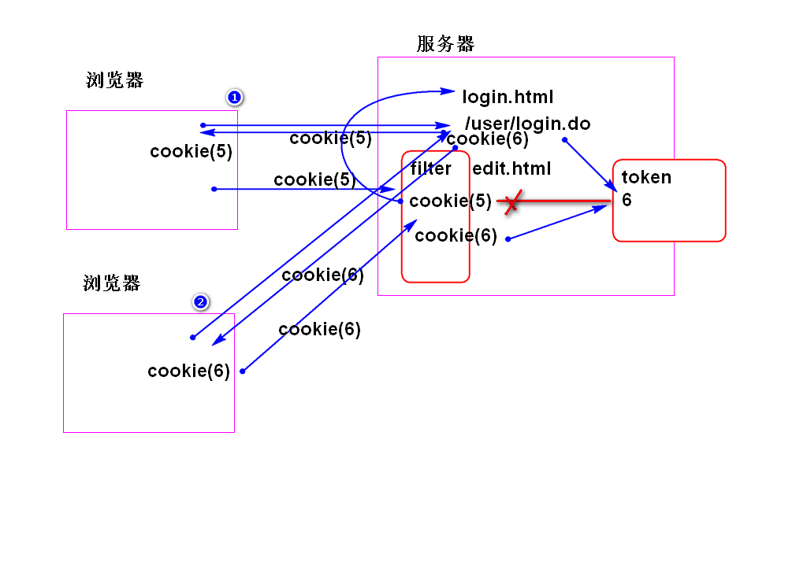

# 云笔记

## 实现登录权限检查

原理：

步骤：

1. 重构数据层，实现更新用户信息的方法
2. 重构业务层登录方法，在登录时候分配新的token
3. 重构控制器，登录时候将token写入到客户端cookie中
4. 重构web.xml 利用 ContextLoaderListener 初始化Spring容器。
5. 创建新的Servlet Filter 检查登录状态。

### 1. 重构数据层，实现更新用户信息的方法

添加更新用户信息方法 UserDao.java:

	int updateUser(Map<String, Object> user);

添加SQL UserMapper.xml:

	<update id="updateUser"
		parameterType="map">
		update 
			cn_user
		set
			<trim suffixOverrides=",">
				<if test="token != null">
					cn_user_token=#{token},
				</if>
				<if test="password != null">
					cn_user_password=#{password},
				</if>
				<if test="nick != null">
					cn_user_nick=#{nick}
				</if>
			</trim>
		where
			cn_user_id=#{id}
	</update>

测试:...

### 2. 重构业务层登录方法，在登录时候分配新的token

重构UserServiceImpl.java 中的login方法:

	...
	if(user.getPassword().equals(md5)){
		//业务处理
		//登录成功，返回用户信息
		String token=UUID.randomUUID().toString();
		user.setToken(token);
		Map<String, Object> data=
			new HashMap<String, Object>();
		data.put("id", user.getId());
		data.put("token", token);
		userDao.updateUser(data);
		return user;
	}
	...

测试...

### 3. 重构控制器，登录时候将token写入到客户端cookie中

重构UserController.java 的login方法：

	@RequestMapping("/login.do")
	@ResponseBody
	public JsonResult<User> login(String name,
			String password,
			HttpServletResponse response){
		User user = 
			userService.login(name, password);
		Cookie cookie = new Cookie("token", 
				user.getToken());
		cookie.setPath("/"); 
		response.addCookie(cookie);
		return new JsonResult<User>(user);
	}

> 提示: 这里的cookie是当前仅仅在会话期间有效。

测试： 在浏览器端检查是否存在cookie 

### 4. 重构web.xml 利用 ContextLoaderListener 初始化Spring容器。

	<servlet>
		<servlet-name>mvc</servlet-name>
			<servlet-class>org.springframework.web.servlet.DispatcherServlet</servlet-class>
		<init-param>
			<param-name>contextConfigLocation</param-name>
			<param-value></param-value>
		</init-param>
		<load-on-startup>1</load-on-startup>
	</servlet>
	<servlet-mapping>
	  <servlet-name>mvc</servlet-name>
	  <url-pattern>*.do</url-pattern>
	</servlet-mapping>
	
	<listener>
		 <listener-class>org.springframework.web.context.ContextLoaderListener</listener-class>
	</listener>
	<context-param>
		  <param-name>contextConfigLocation</param-name>
		  <param-value>classpath:spring-*.xml</param-value>
	</context-param> 

> 提示: 使用工具类WebApplicationContextUtils就必须使用 ContextLoaderListener 初始化Spring容器。

### 5. 创建新的Servlet Filter 检查登录状态。

配置web.xml 添加过滤器配置：

	<filter>
		<filter-name>acl</filter-name>
		<filter-class>cn.tedu.note.web.ACLFilter</filter-class>
	</filter>
	<filter-mapping>
		<filter-name>acl</filter-name>
		<url-pattern>/*</url-pattern>
	</filter-mapping> 

添加过滤器类 ACLFilter.java:
	
	public class ACLFilter implements Filter{
		
		private ServletContext sc;
		private ApplicationContext ctx;
		private UserService userService;
		
		/**
		 * 过滤器初始化代码
		 * 获取了 Spring容器和UserService
		 */
		public void init(FilterConfig cfg)
			throws ServletException {
	 
			sc=	cfg.getServletContext();
			//获取Spring容器
			ctx=WebApplicationContextUtils
				.getWebApplicationContext(sc);
			//从容器中获取 UserService 对象
			userService=ctx.getBean(
					"userService",
					UserService.class);
			
		}
		public void doFilter(
				ServletRequest req, 
				ServletResponse res, 
				FilterChain chain)
				throws IOException, ServletException {
			HttpServletRequest request=
				(HttpServletRequest) req;
			HttpServletResponse response =
				(HttpServletResponse) res;
	
			String path=request.getRequestURI();
			//System.out.println(path);
			
			path = path.substring(
				path.indexOf('/', 1));
			
			//System.out.println("trim path:"+path);
			
			if(path.matches(".*/edit\\.html$")){
				checkLogin(request,response,chain);
				return;
			}
			
			if(path.matches(".(note).*\\.do$")){
				checkDotDo(request,response,chain);
				return;
			}
			
			chain.doFilter(request, response); 
		}
		private void checkDotDo(HttpServletRequest request, HttpServletResponse response, FilterChain chain) 
				throws IOException, ServletException {
			//System.out.println("checkDotDo");
			String token = getCookie(request, "token");
			String userId= getCookie(request,"userId");
			//System.out.println("userId:"+userId); 
			
			if(userService.checkToken(userId, token)){
				chain.doFilter(request, response);
				return;
			}
			
			//没有登录时候，返回JSON错误消息
			String json="{\"state\":1,\"message\":\"必须登录！\"}";
			response.setCharacterEncoding("utf-8");
			response.setContentType(
				"application/json;charset=UTF-8");
			response.getWriter().println(json);
		}
		private String getCookie(HttpServletRequest request, 
				String cookieName) {
			Cookie[] cookies=request.getCookies();
			//如果客户端没有cookie，就会返回null
			if(cookies!=null){
				for (Cookie cookie : cookies) {
					if(cookieName.equals(
							cookie.getName())){
						return cookie.getValue();
					}
				}
			}
			return null;
		}
		private void checkLogin(HttpServletRequest request, HttpServletResponse response, FilterChain chain) 
				throws IOException, ServletException {
			//System.out.println("checkLogin");
			//检查是否有 token cookie 
			//如果没有， 就重定向到log_in.html
			String token = getCookie(request, "token");
			String userId= getCookie(request,"userId");
			//System.out.println("userId:"+userId); 
			if(userService.checkToken(userId, token)){
				chain.doFilter(request, response);
				return;
			}
			//重定向到 log_in.html
			String path=request.getContextPath()+
				"/log_in.html";
			response.sendRedirect(path);
		}
		
		public void destroy() {
		}
	}

添加业务层方法 UserService.java:

	boolean checkToken(String userId, String token);

实现业务层方法：

	public boolean checkToken(
			String userId, String token) {
		if(userId==null || userId.trim().isEmpty()){
			return false;
		}
		if(token==null || token.trim().isEmpty()){
			return false;
		}
		User user = 
			userDao.findUserById(userId);
		if(user==null){
			return false; 
		}
		return token.equals(user.getToken());
	}

测试...

-------------------------

## 作业

实现上述过程，并且调试。
	
