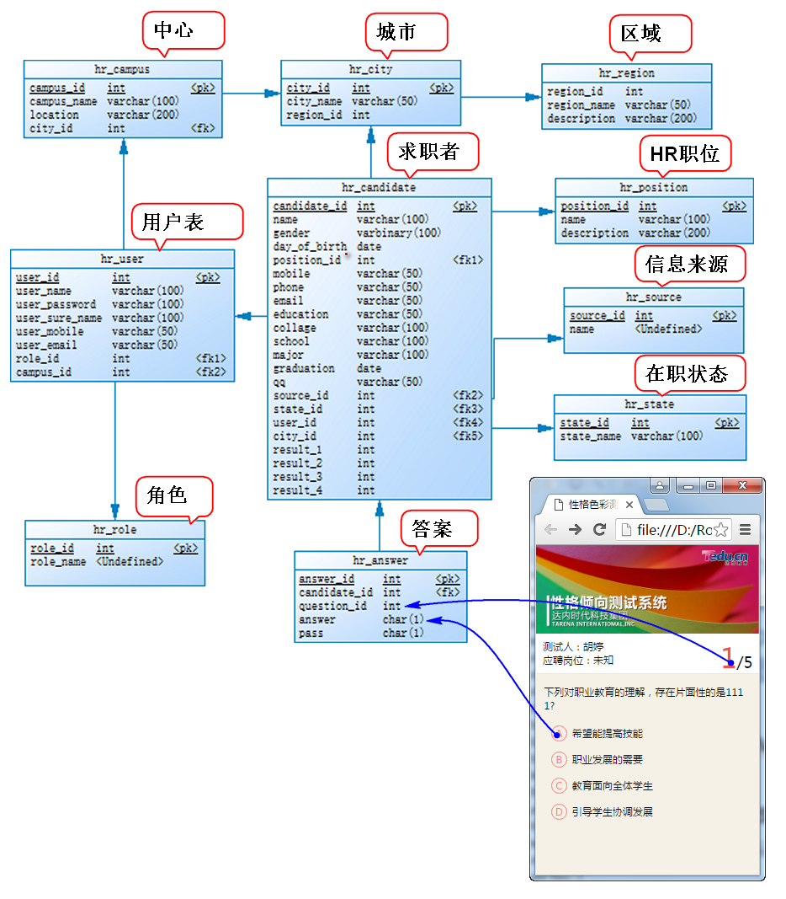
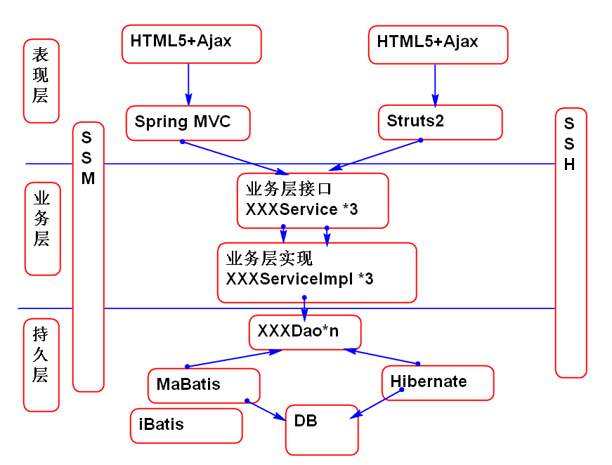
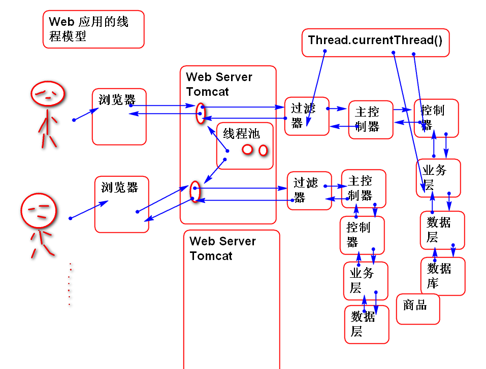
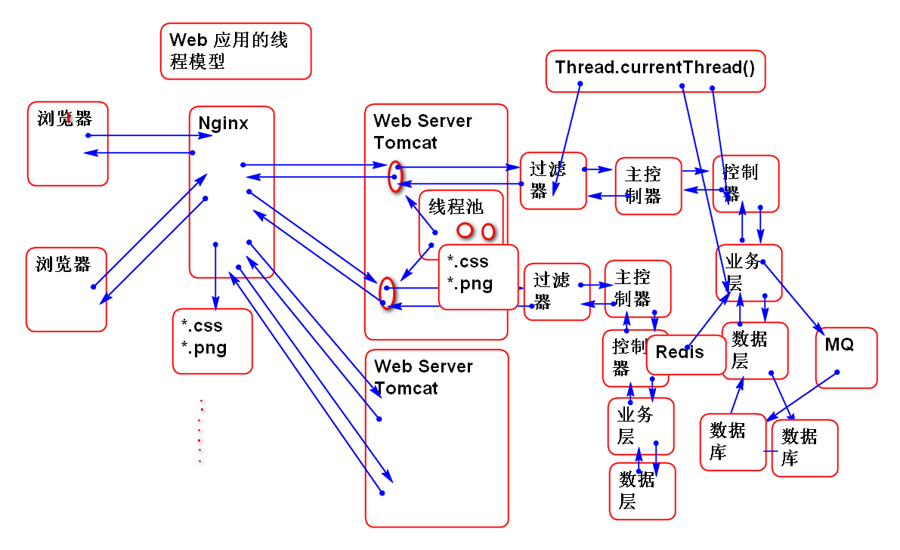
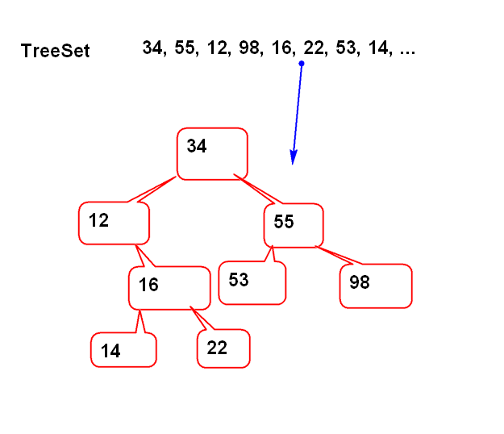
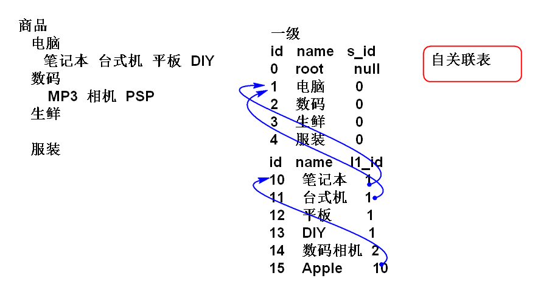

# HR测评系统

## 项目研发流程

1. 与用户沟通项目需求
	- 获得项目需求是一个不断递归的过程
2. 设计产品原型草图
	- 可用利用产品原型工具完成
3. UI与前端开发产品静态原型
	- 需要与用户确认原型功能
4. 根据产品原型设计数据库
	- 产品中一切数据都要适当的存储
	- 可用利用PowerDesigner 完成。
5. 确定产品的架构
6. 根据功能设计和编写代码
	- 这是一个不断迭代的过程， 每次迭代完成一个功能
	- 如果必要可以更新 数据库的设计

## HR测评系统需求描述

HR测评系统其目的是对应聘人员的性格倾向继续基本评估，其评估结果作为参考。

HR将被测评人信息录入到系统，被测评人通过手机二维码进入到测评页面，填写问卷，问卷结果自动统计并且反馈给HR。

系统界面请参考 静态页面部分

## 数据库设计

## 软件结构设计

## 功能实现

请学员参考云笔记，自行实现案例代码。

# 互联网架构

基础软件架构：

互联网架构加Java应用。

互联网架构关键点

1. 高并发： 高用户流量
2. 高性能： 秒级响应
3. 高可用： 24小时永远可用。
4. 可扩展： 可以从小到大不断扩展
5. 可伸缩： 在企业内部进行计算资源调配，解决突发流量问题

## 经典面试题目

1. 有100数，全部是 0~9 个位数，统计每个数字出现的次数。
	ary = {0, 5, 1, 5, ....};
	counter = new int[10];
    for(int i:ary)
		counter[i]++;
	

2. 10万个从0开始连续整数，去掉两个，然后打乱，找出是那两个数？
	
	ary = {2,3,100,234,...};
	boolean[] used = new boolean[100000];
	for(int n:ary){
		used[n]=true;
	}
	
3. 非常多的数，找出最大的前100个
	

代码：

	TreeSet<Integer> set=
			new TreeSet<Integer>(); 
	for(int i=0; i<100000; i++){
		int n = 
			(int)(Math.random()*1000000);
		set.add(n);
		if(set.size()>10){
			Iterator ite=set.iterator();
			ite.next();
			ite.remove();
		}
	}
	System.out.println(set);

4. 将整数转换为16进制字符串

分析：

	int i = 122122;
	char[] chs= {'0','1','2','3',...'f'};
                  0   1   2   3     15
	int n = i & 0xf; // n =  0   1   2  ~ 15 
	char c=chs[n];  //  c = '0' '1' '2' ~ 'f'
	i = i >>> 4; // i>>>=4;
	i = 0 
	n = i & 0xf
	c = chs[n];

代码：

	char[] chs="0123456789abcdef".toCharArray();
	int i = 1292182;
	char[] buf=new char[8];
	int index = buf.length-1;
	do{
		buf[index--]=chs[i&0xf];
		i >>>= 4;
	}while(i!=0);
	String hex = new String(buf, index+1, 8-index-1);

5. 无限分类

